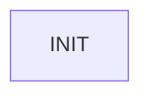

# R-Code Behavior Extract: `R-Code.R`

This file was generated from:

- [MS/OPEN-R/APP/PC/AMS/R-Code.R](/home/cartheur/ame/aiventure/aiventure-github/cartheur-aibo/openr-debian/sdk/R_CODE_plugin_r1/sample/RPlugIn/MS/OPEN-R/APP/PC/AMS/R-Code.R:1)

using:

```bash
python3 scripts/extract-rcode-behavior.py \
  sdk/R_CODE_plugin_r1/sample/RPlugIn/MS/OPEN-R/APP/PC/AMS/R-Code.R
```

## Summary

- source: `sdk/R_CODE_plugin_r1/sample/RPlugIn/MS/OPEN-R/APP/PC/AMS/R-Code.R`
- states: `1`
- transitions: `0`
- commands: `SAVE=4, SEND=1`

## State Blocks

- `INIT`: Act
  lines 1: `SAVE:AUDIO:AUDIO1.WAV`
  lines 2: `SAVE:IMAGE:IMAGE1.BMP`
  lines 3: `SAVE:IMAGE:IMAGE2.BMP`
  lines 4: `SAVE:IMAGE:IMAGE3.BMP`
  lines 5: `SEND:NTP`

## Interpretation

Unlike the older `ERS-111` sample scripts, this `ERS-7` plug-in sample is
not a motion-centric behavior loop.

At the higher level, it is better described as:

```text
invoke plug-in command -> capture/export artifact -> invoke next command
```

That makes it a useful complement to the earlier `ERS-111` samples:

- the older track emphasizes embodied robot behaviors such as search,
  walking, recovery, and interaction
- this `ERS-7` SDK track shows R-Code being extended as an automation and
  services layer on top of `OPEN-R`

## Mermaid


