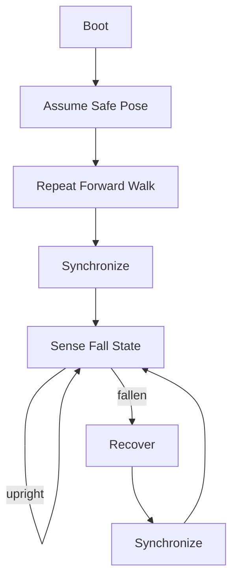
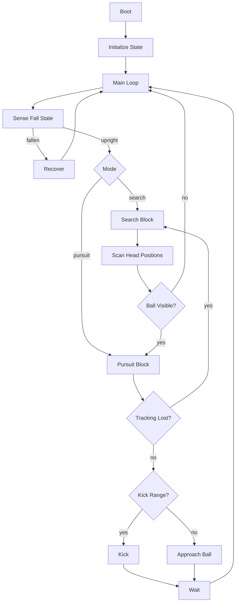
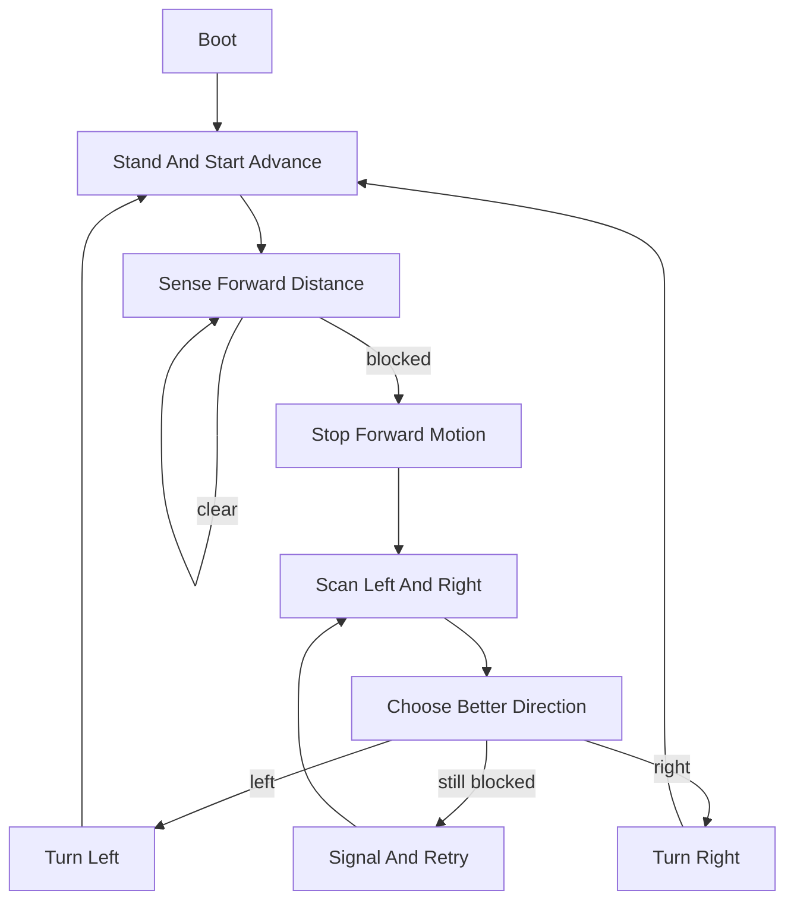

# R-CODE Behavior Abstraction

This note lifts the sample `R-CODE` programs from line-level commands to
a higher-level behavior view.

The goal is not to replace the preserved scripts. The goal is to make it
easier to see that many of the samples are really small behavior graphs
built from a few recurring blocks.

## Main Idea

At the raw level, R-Code is written as individual commands such as:

- `SET`
- `POSE`
- `MOVE`
- `PLAY`
- `WAIT`
- `IF`
- `GO`
- `SWITCH`
- `CASE`
- `QUIT`

At a higher level, the same programs can usually be read as a sequence of
behavior blocks:

1. `Boot`
2. `Initialize State`
3. `Assume Safe Pose`
4. `Sense`
5. `Decide`
6. `Act`
7. `Synchronize`
8. `Recover`
9. `Loop`

## Block Vocabulary

Use this vocabulary when reading or describing an R-Code sample.

| Block | Typical R-Code | Meaning |
|---|---|---|
| `Boot` | `SET:Power:1` | Turn the robot behavior on |
| `Initialize State` | `SET:mode:0`, `SET:head:0` | Create working memory for the behavior |
| `Assume Safe Pose` | `POSE:AIBO:...` | Move into a known pose before acting |
| `Sense` | `SET:stat:Gsensor_status`, `Distance`, `Cdt_npixel` | Read robot or environment state |
| `Decide` | `IF`, `SWITCH`, `CASE` | Branch into behavior modes |
| `Act` | `MOVE:*`, `PLAY:*`, `POSE:*` | Perform motion, sound, or expression |
| `Synchronize` | `WAIT`, `WAIT:n` | Let a motion or transition complete |
| `Recover` | `QUIT:AIBO`, `MOVE:AIBO:ReactiveGU` | Escape a bad state such as a fall |
| `Loop` | `GO`, labels such as `:100` | Repeat the behavior cycle |

## Common Sample Shapes

Across `src/R-CODE/sample/`, most programs fit one of these shapes.

### 1. Playback Sequence

Used by samples like `PlayAIBO.R`, `PlayHead.R`, and `PlaySound.R`.

```text
Boot -> Safe Pose -> Play Item -> Wait -> Play Next Item -> Wait -> ...
```

These are closer to scripted demonstrations than reactive autonomy.

### 2. Motion Loop With Safety Recovery

Used by samples like `Move` (from `MoveAIBO.R`), `WalkDog2.R`, and `StepDog2.R`.

```text
Boot -> Safe Pose -> Repeat Motion -> Wait -> Check Fall Sensor
     -> if fallen: Recover -> return to monitoring
```

This is a simple action loop with a protective interrupt.

### 3. Sense-Decide-Act Loop

Used by samples like `Football` (from `SoccerDog1.R`), `Maze` (from `Maze1.R`), and `C-Tracking`.

```text
Boot -> Init State -> Sense -> Decide -> Act -> Wait -> Sense again
```

This is the clearest "behavior program" form in the sample set.

### 4. Event Or Callback Driven Flow

Used by samples like `Recover.R`, `Maze5.R`, and `MotionRec.R`.

```text
Boot -> Register/enter loop -> Event occurs -> Handler runs -> Resume
```

This is closer to a tiny behavior runtime than a plain script.

## Sample 1: `Move`

Files:

- preserved source: [../sample/MoveAIBO.R](/home/cartheur/ame/aiventure/aiventure-github/cartheur-aibo/aibo-lab/src/R-CODE/sample/MoveAIBO.R:1)
- generated viewer: [../generated/Move.html](/home/cartheur/ame/aiventure/aiventure-github/cartheur-aibo/aibo-lab/src/R-CODE/generated/Move.html:1)

Raw behavior:

- power on
- sit in a known pose
- walk forward repeatedly
- play a sound cue during each movement
- monitor the G-sensor
- if fallen, run turnover recovery

High-level block view:



This is best described as:

`locomotion demo + fall monitoring + automatic recovery`

## Sample 2: `Football`

Files:

- preserved source: [../sample/SoccerDog1.R](/home/cartheur/ame/aiventure/aiventure-github/cartheur-aibo/aibo-lab/src/R-CODE/sample/SoccerDog1.R:1)
- generated analysis: [../generated/Football-Behavior.md](/home/cartheur/ame/aiventure/aiventure-github/cartheur-aibo/aibo-lab/src/R-CODE/generated/Football-Behavior.md:1)
- generated viewer: [../generated/Football.html](/home/cartheur/ame/aiventure/aiventure-github/cartheur-aibo/aibo-lab/src/R-CODE/generated/Football.html:1)

Raw behavior:

- power on
- keep mode variables such as `mode`, `head`, and `lost`
- check for fall state
- if searching, rotate and scan head positions
- if a ball is seen, switch to pursuit
- if near enough, kick
- if tracking is lost, return to search

High-level block view:



This is best described as:

`two-mode finite-state behavior: search -> pursue -> kick/recover`

## Sample 3: `Maze`

Files:

- preserved source: [../sample/Maze1.R](/home/cartheur/ame/aiventure/aiventure-github/cartheur-aibo/aibo-lab/src/R-CODE/sample/Maze1.R:1)
- generated viewer: [../generated/Maze.html](/home/cartheur/ame/aiventure/aiventure-github/cartheur-aibo/aibo-lab/src/R-CODE/generated/Maze.html:1)

Raw behavior:

- stand and start walking forward
- watch distance to obstacles
- if blocked, stop forward motion
- sweep the head left and right
- remember the best open direction
- turn toward the better side
- continue moving

High-level block view:



This is best described as:

`obstacle avoidance by scan, compare, and reorient`

## A Compact Reading Rule

When reading a new sample, translate it in this order:

1. Find `Boot` and initial `POSE`.
2. Find labels such as `:100`, `:2000`, and treat them as named states.
3. Group consecutive `MOVE` or `PLAY` lines into one `Act` block.
4. Treat `WAIT` as synchronization boundaries.
5. Treat sensor reads plus `IF` chains as one `Sense/Decide` block.
6. Treat any `QUIT` or `ReactiveGU` path as `Recover`.

## Suggested State Names

For repo discussion, these names are easier to reason about than raw line
labels:

- `Idle`
- `Search`
- `Track`
- `Approach`
- `Kick`
- `Avoid`
- `Recover`
- `Playback`
- `Scan`

For example, `Football` can be described as:

`Recover`, `Search`, `Track`, `Approach`, and `Kick` states connected by
sensor-driven transitions.

## Why This Helps

- it lets us discuss sample behavior without staying stuck at syntax level
- it makes the scripts look more like finite-state robot behaviors
- it creates a bridge between preserved Sony samples and later design work
- it stays faithful to the original `ERS-111` material while giving us a
  clearer analysis vocabulary

## Extractor Workflow

The repo now includes a working extractor:

- [../../../scripts/extract-rcode-behavior.py](/home/cartheur/ame/aiventure/aiventure-github/cartheur-aibo/aibo-lab/scripts/extract-rcode-behavior.py:1)

Use it to write sidecars for preserved sample scripts:

```bash
python3 scripts/extract-rcode-behavior.py --write-sidecars \
  src/R-CODE/sample/MoveAIBO.R
```

For scripts under `src/R-CODE/sample/`, the tool now writes generated
outputs to:

- `src/R-CODE/generated/*.behavior.md`
- `src/R-CODE/generated/*.mmd`
- `src/R-CODE/generated/*.html`
