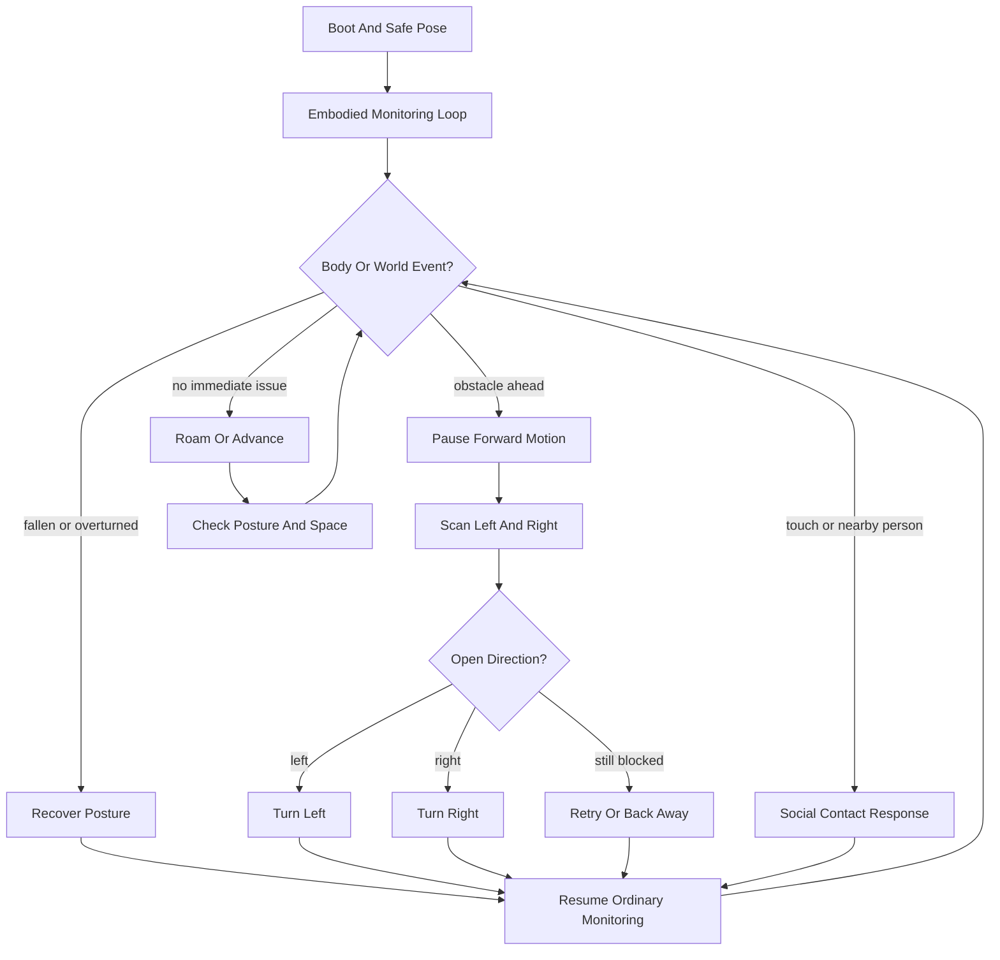

# Everyday Embodied Behaviors

This note proposes a single composite diagram for the subset of `R-CODE`
behaviors that read as everyday embodied activity rather than games,
stunts, or explicit demonstrations.

The point is not to claim that Sony shipped one literal script with this
exact topology. The point is to create a higher-level research
representation that gathers the ordinary body-level concerns already
visible across the preserved `ERS-111` samples.

Included behavior motifs:

- locomotion and roaming from `Move`, `Walk`, and `WalkAround`
- obstacle checking and reorientation from `Maze`
- touch or nearby-person response from `Ote` and `HyperBaby`
- fall or turnover recovery from `Move` and `Recover`

Excluded from this composite:

- game-specific pursuit and kick logic such as `Football` and `HyperFootball`
- explicit show or playback routines such as `Play*`, `Pose*`, and `MotionRec`
- one-off expressive demos whose main purpose is display rather than ordinary autonomy

Files:

- composite diagram: [../generated/EmbodiedBehaviors.mmd](/home/cartheur/ame/aiventure/aiventure-github/cartheur-aibo/openr-debian/src/R-CODE/generated/EmbodiedBehaviors.mmd:1)
- viewer: [../generated/EmbodiedBehaviors.html](/home/cartheur/ame/aiventure/aiventure-github/cartheur-aibo/openr-debian/src/R-CODE/generated/EmbodiedBehaviors.html:1)
- svg export: [../generated/EmbodiedBehaviors.svg](/home/cartheur/ame/aiventure/aiventure-github/cartheur-aibo/openr-debian/src/R-CODE/generated/EmbodiedBehaviors.svg:1)

Interpretation:

`ordinary embodied loop = maintain posture -> watch surroundings -> move if clear -> reorient if blocked -> respond if contacted -> recover if fallen`

Why this is useful:

- it gives us one analyzable umbrella representation for non-game bodily behavior
- it separates everyday autonomy from specialized samples like ball play or playback
- it creates a shared reference frame for comparing future diagrams
