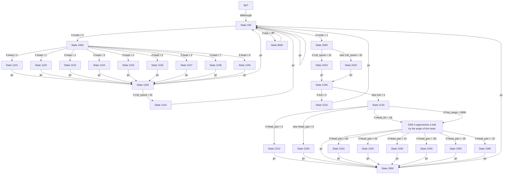

# R-Code Behavior Extract: `SoccerDog1.R`

This file was generated from:

- [../sample/SoccerDog1.R](/home/cartheur/ame/aiventure/aiventure-github/cartheur-aibo/openr-debian/src/R-CODE/sample/SoccerDog1.R:1)

using:

```bash
python3 scripts/extract-rcode-behavior.py src/R-CODE/sample/SoccerDog1.R
```

## Summary

- source: `src/R-CODE/sample/SoccerDog1.R`
- states: `31`
- transitions: `54`
- commands: `GO=26, IF=24, MOVE=23, SET=9, WAIT=3, ADD=2, AND=1, MOD=1, QUIT=1`
- sensed variables: `Cdt_npixel, Gsensor_status, Head_pan, Head_tilt, Psd_range`

## State Blocks

- `INIT`: Boot
  lines 5: `SET:Power:1`
  lines 7: `SET:mode:0`
  lines 8: `SET:head:0`
  lines 9: `SET:lost:0`
- `State 100`: Initialize State, Sense/Decide, Loop/Transition
  lines 12: `SET:stat:Gsensor_status`
  lines 13: `AND:stat:1`
  lines 14: `IF:=:stat:1:9000`
  lines 15: `IF:=:mode:0:1000`
  lines 16: `IF:=:mode:1:2000`
  ... `1` more instructions
- `State 1000`: Sense/Decide, Act
  lines 20: `MOVE:LEGS:STEP:RIGHT_TURN:0:4`
  lines 21: `IF:=:head:0:1101`
  lines 22: `IF:=:head:1:1102`
  lines 23: `IF:=:head:2:1103`
  lines 24: `IF:=:head:3:1104`
  ... `5` more instructions
- `State 1101`: Act, Loop/Transition
  lines 31: `MOVE:HEAD:ABS:-15:0:0:500`
  lines 32: `GO:1200`
- `State 1102`: Act, Loop/Transition
  lines 34: `MOVE:HEAD:ABS:-15:-40:0:500`
  lines 35: `GO:1200`
- `State 1103`: Act, Loop/Transition
  lines 37: `MOVE:HEAD:ABS:-15:-80:0:500`
  lines 38: `GO:1200`
- `State 1104`: Act, Loop/Transition
  lines 40: `MOVE:HEAD:ABS:-45:-40:0:500`
  lines 41: `GO:1200`
- `State 1105`: Act, Loop/Transition
  lines 43: `MOVE:HEAD:ABS:-45:0:0:500`
  lines 44: `GO:1200`
- `State 1106`: Act, Loop/Transition
  lines 46: `MOVE:HEAD:ABS:-45:40:0:500`
  lines 47: `GO:1200`
- `State 1107`: Act, Loop/Transition
  lines 49: `MOVE:HEAD:ABS:-45:80:0:500`
  lines 50: `GO:1200`
- `State 1108`: Act, Loop/Transition
  lines 52: `MOVE:HEAD:ABS:-15:40:0:500`
  lines 53: `GO:1200`
- `State 1109`: Act, Loop/Transition
  lines 55: `MOVE:HEAD:ABS:-15:0:0:500`
  lines 56: `GO:1200`
- `State 1200`: Initialize State, Sense/Decide, Loop/Transition
  lines 58: `ADD:head:1`
  lines 59: `MOD:head:9`
  lines 60: `IF:<:Cdt_npixel:32:1210`
  lines 61: `SET:mode:1`
  lines 62: `GO:100`
- `State 1210`: Synchronize, Loop/Transition
  lines 64: `WAIT`
  lines 65: `GO:100`
- `State 2000`: Sense/Decide
  lines 68: `IF:<:Cdt_npixel:32:2010:2020`
- `State 2010`: Loop/Transition
  lines 70: `ADD:lost:1`
  lines 71: `GO:2100`
- `State 2020`: Initialize State, Loop/Transition
  lines 73: `SET:lost:0`
  lines 74: `GO:2100`
- `State 2100`: Sense/Decide
  lines 76: `IF:>:lost:0:2110:2120`
- `State 2110`: Initialize State, Loop/Transition
  lines 78: `SET:mode:0`
  lines 79: `GO:100`
- `State 2120`: Initialize State, Sense/Decide, Act
  lines 81: `SET:mode:1`
  lines 82: `MOVE:HEAD:C-TRACKING:1000`
  lines 84: `IF:>:Head_tilt:-58:2300`
  lines 85: `IF:>:Psd_range:9999:2300`
  lines 87: `IF:>:Head_pan:0:2210:2220`
- `State 2210`: Act, Loop/Transition
  lines 89: `MOVE:LEGS:KICK:LEFT_KICK:0`
  lines 90: `MOVE:LEGS:STEP:SLOW:FORWARD:1`
  lines 91: `GO:2900`
- `State 2220`: Act, Loop/Transition
  lines 93: `MOVE:LEGS:KICK:RIGHT_KICK:0`
  lines 94: `MOVE:LEGS:STEP:SLOW:FORWARD:1`
  lines 95: `GO:2900`
- `2300 It approaches a ball by the angle of the head.`: Sense/Decide, Act, Loop/Transition
  lines 98: `IF:>:Head_pan:60:2310`
  lines 99: `IF:>:Head_pan:45:2320`
  lines 100: `IF:>:Head_pan:15:2330`
  lines 101: `IF:<:Head_pan:-60:2340`
  lines 102: `IF:<:Head_pan:-45:2350`
  ... `3` more instructions
- `State 2310`: Act, Loop/Transition
  lines 107: `MOVE:LEGS:STEP:LEFT_TURN:0:4`
  lines 108: `GO:2900`
- `State 2320`: Act, Loop/Transition
  lines 110: `MOVE:LEGS:STEP:SLOW:LEFT:4`
  lines 111: `GO:2900`
- `State 2330`: Act, Loop/Transition
  lines 113: `MOVE:LEGS:STEP:SLOW:LEFTFORWARD:4`
  lines 114: `GO:2900`
- `State 2340`: Act, Loop/Transition
  lines 116: `MOVE:LEGS:STEP:RIGHT_TURN:0:4`
  lines 117: `GO:2900`
- `State 2350`: Act, Loop/Transition
  lines 119: `MOVE:LEGS:STEP:SLOW:RIGHT:4`
  lines 120: `GO:2900`
- `State 2360`: Act, Loop/Transition
  lines 122: `MOVE:LEGS:STEP:SLOW:RIGHTFORWARD:4`
  lines 123: `GO:2900`
- `State 2900`: Synchronize, Loop/Transition
  lines 125: `WAIT`
  lines 126: `GO:100`
- `State 9000`: Act, Synchronize, Recover, Loop/Transition
  lines 129: `QUIT:AIBO`
  lines 130: `MOVE:AIBO:ReactiveGU`
  lines 131: `WAIT`
  lines 132: `GO:100`

## Transitions

- `INIT` -> `100`: fallthrough
- `100` -> `9000`: if `stat = 1`
- `100` -> `1000`: if `mode = 0`
- `100` -> `2000`: if `mode = 1`
- `100` -> `100`: go
- `1000` -> `1101`: if `head = 0`
- `1000` -> `1102`: if `head = 1`
- `1000` -> `1103`: if `head = 2`
- `1000` -> `1104`: if `head = 3`
- `1000` -> `1105`: if `head = 4`
- `1000` -> `1106`: if `head = 5`
- `1000` -> `1107`: if `head = 6`
- `1000` -> `1108`: if `head = 7`
- `1000` -> `1109`: if `head = 8`
- `1101` -> `1200`: go
- `1102` -> `1200`: go
- `1103` -> `1200`: go
- `1104` -> `1200`: go
- `1105` -> `1200`: go
- `1106` -> `1200`: go
- `1107` -> `1200`: go
- `1108` -> `1200`: go
- `1109` -> `1200`: go
- `1200` -> `1210`: if `Cdt_npixel < 32`
- `1200` -> `100`: go
- `1210` -> `100`: go
- `2000` -> `2010`: if `Cdt_npixel < 32`
- `2000` -> `2020`: else `Cdt_npixel < 32`
- `2010` -> `2100`: go
- `2020` -> `2100`: go
- `2100` -> `2110`: if `lost > 0`
- `2100` -> `2120`: else `lost > 0`
- `2110` -> `100`: go
- `2120` -> `2300`: if `Head_tilt > -58`
- `2120` -> `2300`: if `Psd_range > 9999`
- `2120` -> `2210`: if `Head_pan > 0`
- `2120` -> `2220`: else `Head_pan > 0`
- `2210` -> `2900`: go
- `2220` -> `2900`: go
- `2300` -> `2310`: if `Head_pan > 60`
- `2300` -> `2320`: if `Head_pan > 45`
- `2300` -> `2330`: if `Head_pan > 15`
- `2300` -> `2340`: if `Head_pan < -60`
- `2300` -> `2350`: if `Head_pan < -45`
- `2300` -> `2360`: if `Head_pan < -15`
- `2300` -> `2900`: go
- `2310` -> `2900`: go
- `2320` -> `2900`: go
- `2330` -> `2900`: go
- `2340` -> `2900`: go
- `2350` -> `2900`: go
- `2360` -> `2900`: go
- `2900` -> `100`: go
- `9000` -> `100`: go

## Mermaid


