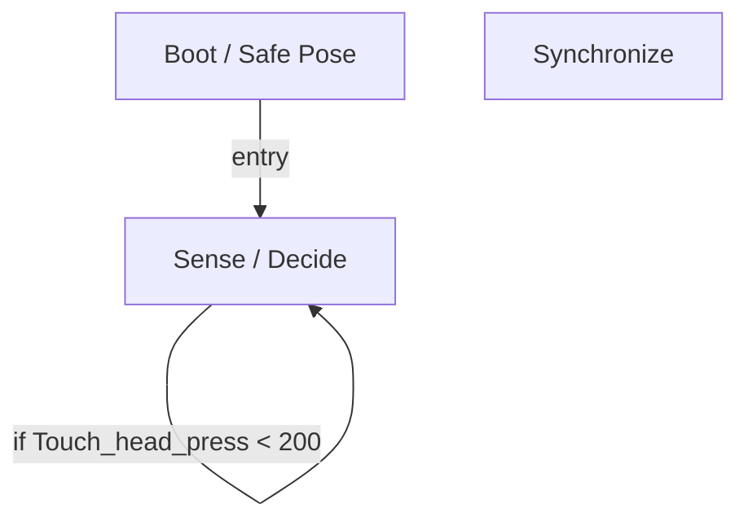

# R-Code Behavior Extract: `AngryDog.R`

## Summary

- category: `Behavior`
- source: `src/R-CODE/sample/AngryDog.R`
- states: `3`
- transitions: `2`
- commands: `WAIT=3, PLAY=3, SET=2, POSE=1, IF=1`
- sensed variables: `Touch_head_press`

## State Blocks

- `Boot / Safe Pose`: Boot, Assume Safe Pose, Synchronize
  lines 5: `SET:Power:1`
  lines 6: `POSE:AIBO:slp_slp`
  lines 7: `WAIT`
  lines 8: `SET:Touch_head_press:0`
- `Sense / Decide`: Sense/Decide
  lines 11: `IF:<:Touch_head_press:200:100`
- `Synchronize`: Act, Synchronize
  lines 14: `PLAY:AIBO:Tail3_sta`
  lines 15: `WAIT`
  lines 16: `PLAY:SOUND:ang5_dda:30`
  lines 17: `PLAY:LIGHT:ang1_eye:10`
  lines 18: `WAIT`

## Transitions

- `INIT` -> `100`: entry
- `100` -> `100`: if Touch_head_press < 200

## Mermaid

