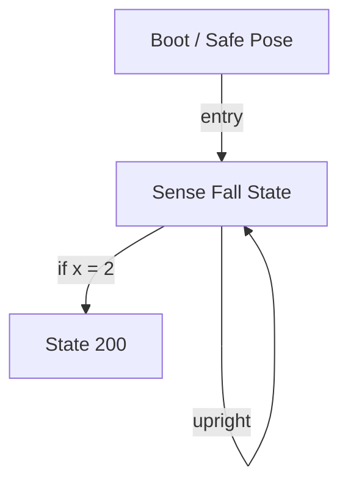

# R-Code Behavior Extract: `QuitDog2.R`

## Summary

- category: `Behavior`
- family: `BallQuit`
- variant: `v2`
- source: `src/R-CODE/sample/QuitDog2.R`
- states: `3`
- transitions: `3`
- commands: `SET=1, POSE=1, WAIT=1, LET=1, AND=1, MOVE=1, IF=1, GO=1, QUIT=1`
- sensed variables: `Gsensor_status`

## State Blocks

- `Boot / Safe Pose`: Boot, Assume Safe Pose, Synchronize
  lines 5: `SET:Power:1`
  lines 6: `POSE:AIBO:std_std`
  lines 7: `WAIT`
- `Sense Fall State`: Sense/Decide, Act, Loop/Transition
  lines 10: `LET:x:Gsensor_status`
  lines 11: `AND:x:3`
  lines 13: `MOVE:LEGS:WALK:SLOW:FORWARD:0`
  lines 14: `IF:=:x:2:200`
  lines 15: `GO:100`
- `State 200`: Act, Recover
  lines 18: `QUIT:AIBO`

## Transitions

- `INIT` -> `100`: entry
- `100` -> `200`: if x = 2
- `100` -> `100`: upright

## Mermaid

