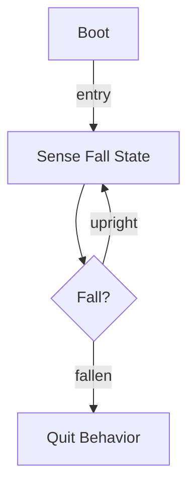

# R-Code Behavior Extract: `QuitDog3.R`

## Summary

- category: `Behavior`
- family: `BallQuit`
- variant: `v3`
- source: `src/R-CODE/sample/QuitDog3.R`
- states: `3`
- transitions: `3`
- commands: `SET=2, AND=1, IF=1, MOVE=1, GO=1, QUIT=1`
- sensed variables: `Gsensor_status`

## State Blocks

- `Boot`: Boot
  lines 5: `SET:Power:1`
- `Sense Fall State`: Initialize State, Sense/Decide, Act, Loop/Transition
  lines 8: `SET:stat:Gsensor_status`
  lines 9: `AND:stat:1`
  lines 11: `IF:=:stat:1:200`
  lines 12: `MOVE:LEGS:WALK:SLOW:FORWARD:0`
  lines 13: `GO:100`
- `Quit Behavior`: Act, Recover
  lines 16: `QUIT:AIBO`

## Transitions

- `INIT` -> `100`: entry
- `100` -> `200`: fallen
- `100` -> `100`: upright

## Mermaid

