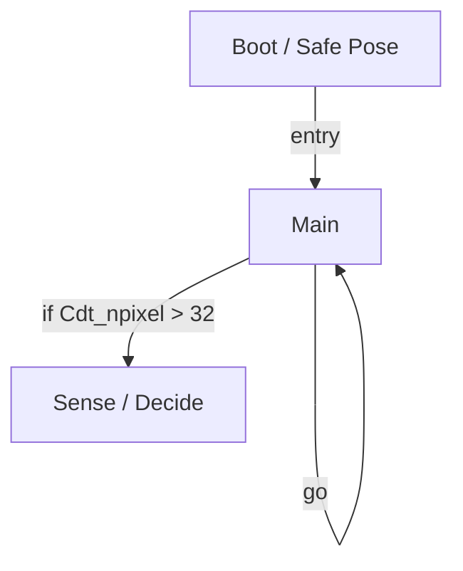

# R-Code Behavior Extract: `QuitDog1.R`

## Summary

- category: `Behavior`
- source: `src/R-CODE/sample/QuitDog1.R`
- states: `3`
- transitions: `3`
- commands: `CASE=8, SET=2, SWITCH=2, POSE=1, IF=1, ADD=1, MOD=1, WAIT=1, GO=1`
- sensed variables: `Cdt_npixel`

## State Blocks

- `Boot / Safe Pose`: Boot, Assume Safe Pose
  lines 5: `SET:Power:1`
  lines 6: `POSE:AIBO:slp_slp`
  lines 8: `SET:motion:0`
- `Main`: Sense/Decide, Synchronize, Loop/Transition
  lines 11: `IF:>:Cdt_npixel:32:1000`
  lines 13: `SWITCH:motion`
  lines 14: `CASE:0:PLAY:AIBO:Yes_sit`
  lines 15: `CASE:1:MOVE:LEGS:STEP:SLOW:1:10`
  lines 16: `CASE:2:MOVE:HEAD:ABS:90:0:0:1000`
  ... `5` more instructions
- `Sense / Decide`: Sense/Decide
  lines 24: `SWITCH:motion`
  lines 25: `CASE:0:QUIT:AIBO`
  lines 26: `CASE:1:QUIT:LEGS`
  lines 27: `CASE:2:QUIT:HEAD`
  lines 28: `CASE:3:QUIT:TAIL`

## Transitions

- `INIT` -> `100`: entry
- `100` -> `1000`: if Cdt_npixel > 32
- `100` -> `100`: go

## Mermaid

