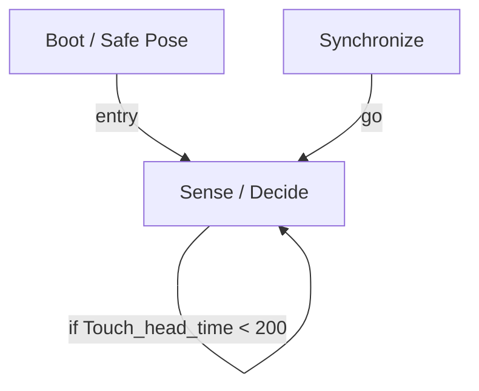

# R-Code Behavior Extract: `BanzaiDog.R`

## Summary

- source: `src/R-CODE/sample/BanzaiDog.R`
- states: `3`
- transitions: `3`
- commands: `SET=2, PLAY=2, POSE=1, IF=1, WAIT=1, GO=1`
- sensed variables: `Touch_head_time`

## State Blocks

- `Boot / Safe Pose`: Boot, Assume Safe Pose
  lines 5: `SET:Power:1`
  lines 6: `POSE:AIBO:slp_slp`
- `Sense / Decide`: Sense/Decide
  lines 9: `IF:<:Touch_head_time:200:100`
- `Synchronize`: Initialize State, Act, Synchronize, Loop/Transition
  lines 13: `PLAY:AIBO:Banzai_sit_C`
  lines 14: `PLAY:SOUND:banz1ttp:50`
  lines 15: `WAIT`
  lines 17: `SET:Touch_head_time:0`
  lines 18: `GO:100`

## Transitions

- `INIT` -> `100`: entry
- `100` -> `100`: if Touch_head_time < 200
- `200` -> `100`: go

## Mermaid

