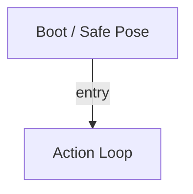

# R-Code Behavior Extract: `C-Tracking2.R`

## Summary

- category: `Behavior`
- family: `C-Tracking`
- variant: `v2`
- source: `src/R-CODE/sample/C-Tracking2.R`
- states: `2`
- transitions: `1`
- commands: `SET=1, POSE=1, MOVE=1, WAIT=1`

## State Blocks

- `Boot / Safe Pose`: Boot, Assume Safe Pose
  lines 5: `SET:Power:1`
  lines 6: `POSE:AIBO:slp_slp`
- `Action Loop`: Act, Synchronize
  lines 9: `MOVE:HEAD:C-TRACKING`
  lines 10: `WAIT`

## Transitions

- `INIT` -> `100`: entry

## Mermaid

