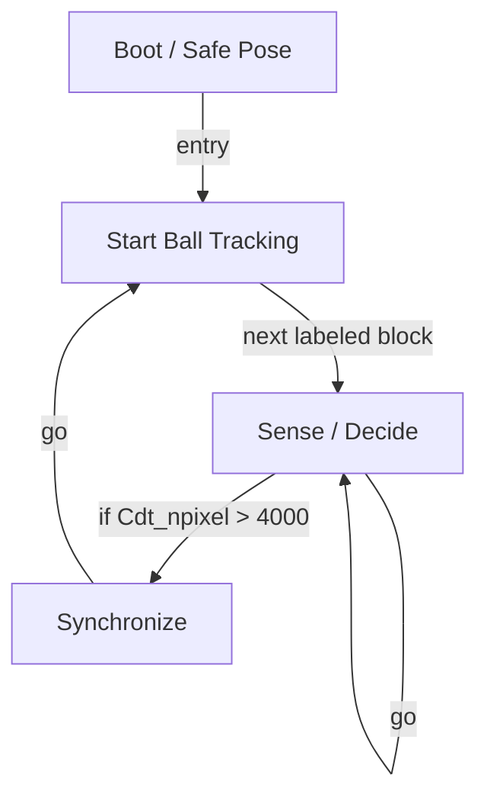

# R-Code Behavior Extract: `C-Tracking4.R`

## Summary

- category: `Behavior`
- family: `C-Tracking`
- variant: `v4`
- source: `src/R-CODE/sample/C-Tracking4.R`
- states: `4`
- transitions: `5`
- commands: `MOVE=2, GO=2, PLAY=2, WAIT=2, SET=1, POSE=1, IF=1`
- sensed variables: `Cdt_npixel`

## State Blocks

- `Boot / Safe Pose`: Boot, Assume Safe Pose
  lines 5: `SET:Power:1`
  lines 6: `POSE:AIBO:slp_slp`
- `Start Ball Tracking`: Act
  lines 9: `MOVE:LEGS:WALK:0:1:0`
  lines 10: `MOVE:HEAD:C-TRACKING:100`
- `Sense / Decide`: Sense/Decide, Loop/Transition
  lines 12: `IF:>:Cdt_npixel:4000:300`
  lines 13: `GO:200`
- `Synchronize`: Act, Synchronize, Loop/Transition
  lines 15: `PLAY:HEAD:CTToStay`
  lines 16: `WAIT`
  lines 17: `PLAY:AIBO:Joy1_std`
  lines 18: `WAIT`
  lines 19: `GO:100`

## Transitions

- `INIT` -> `100`: entry
- `100` -> `200`: next labeled block
- `200` -> `300`: if Cdt_npixel > 4000
- `200` -> `200`: go
- `300` -> `100`: go

## Mermaid

