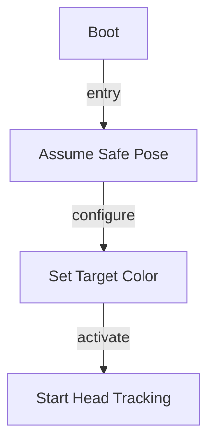

# R-Code Behavior Extract: `C-Tracking1.R`

## Summary

- source: `src/R-CODE/sample/C-Tracking1.R`
- states: `1`
- transitions: `0`
- commands: `SET=2, POSE=1, MOVE=1`

## State Blocks

- `Boot / Safe Pose`: Boot, Assume Safe Pose, Act
  lines 5: `SET:Power:1`
  lines 6: `POSE:AIBO:slp_slp`
  lines 8: `SET:COLOR:PINK`
  lines 9: `MOVE:HEAD:C-TRACKING:1000`

## Transitions

## Mermaid

