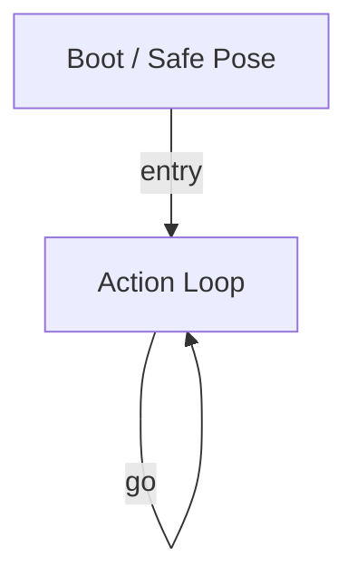

# R-Code Behavior Extract: `CrossingDog.R`

## Summary

- category: `Behavior`
- source: `src/R-CODE/sample/CrossingDog.R`
- states: `2`
- transitions: `2`
- commands: `MOVE=7, POSE=4, SET=1, WAIT=1, GO=1`

## State Blocks

- `Boot / Safe Pose`: Boot, Assume Safe Pose
  lines 6: `SET:Power:1`
  lines 7: `POSE:AIBO:slp_slp`
- `Action Loop`: Assume Safe Pose, Act, Synchronize, Loop/Transition
  lines 11: `POSE:AIBO:oStanding`
  lines 15: `MOVE:HEAD:ABS:0:-90:0:3000`
  lines 16: `MOVE:HEAD:ABS:0:0:0:3000`
  lines 17: `MOVE:HEAD:ABS:0:90:0:3000`
  lines 18: `MOVE:HEAD:ABS:0:0:0:3000`
  ... `7` more instructions

## Transitions

- `INIT` -> `100`: entry
- `100` -> `100`: go

## Mermaid

