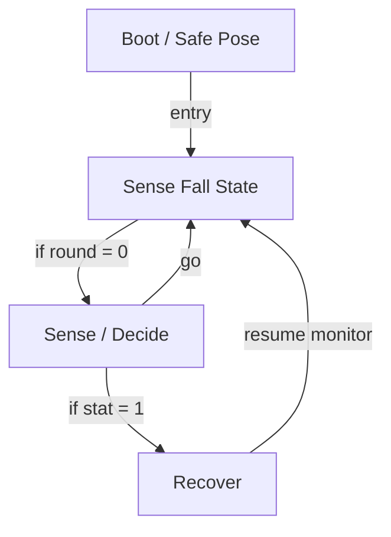

# R-Code Behavior Extract: `FalldownDog.R`

## Summary

- category: `Behavior`
- source: `src/R-CODE/sample/FalldownDog.R`
- states: `4`
- transitions: `5`
- commands: `SET=3, IF=3, MOVE=3, GO=2, POSE=1, AND=1, QUIT=1, WAIT=1`
- sensed variables: `Gsensor_status`

## State Blocks

- `Boot / Safe Pose`: Boot, Assume Safe Pose
  lines 6: `SET:Power:1`
  lines 7: `POSE:AIBO:slp_slp`
- `Sense Fall State`: Initialize State, Sense/Decide
  lines 10: `SET:stat:Gsensor_status`
  lines 11: `AND:stat:1`
  lines 12: `SET:round:0`
  lines 13: `IF:=:round:0:1000`
- `Sense / Decide`: Sense/Decide, Act, Loop/Transition
  lines 17: `MOVE:LEGS:STEP:SLOW:FORWARD:20`
  lines 18: `IF:=:stat:1:9000`
  lines 19: `MOVE:LEGS:STEP:RIGHT_TURN:0:13`
  lines 20: `IF:=:stat:1:9000`
  lines 21: `GO:100`
- `Recover`: Act, Synchronize, Recover, Loop/Transition
  lines 25: `QUIT:AIBO`
  lines 26: `MOVE:AIBO:ReactiveGU`
  lines 27: `WAIT`
  lines 28: `GO:100`

## Transitions

- `INIT` -> `100`: entry
- `100` -> `1000`: if round = 0
- `1000` -> `9000`: if stat = 1
- `1000` -> `100`: go
- `9000` -> `100`: resume monitor

## Mermaid

