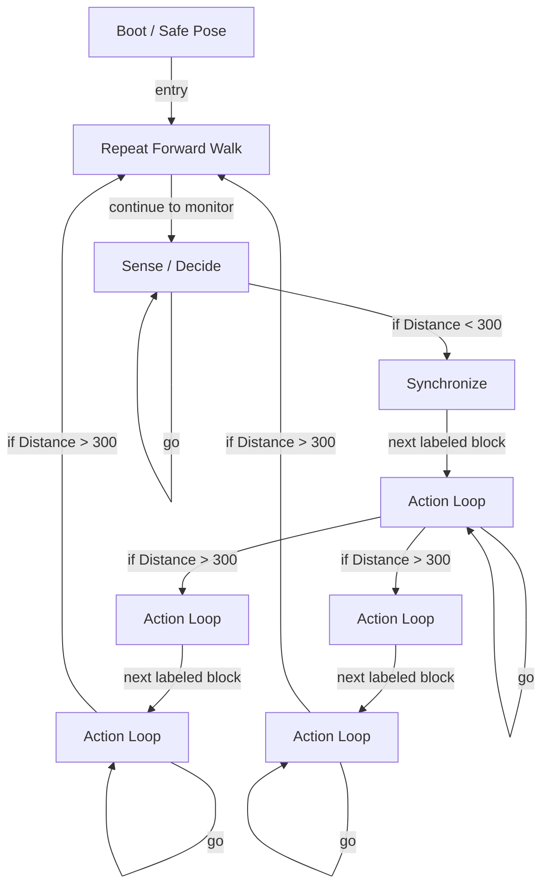

# R-Code Behavior Extract: `Guru2.R`

## Summary

- category: `Behavior`
- family: `Guru`
- variant: `v2`
- source: `src/R-CODE/sample/Guru2.R`
- states: `9`
- transitions: `14`
- commands: `WAIT=13, MOVE=10, IF=5, GO=4, POSE=2, PLAY=2, SET=1`
- sensed variables: `Distance`

## State Blocks

- `Boot / Safe Pose`: Boot, Assume Safe Pose, Synchronize
  lines 5: `SET:Power:1`
  lines 6: `POSE:AIBO:slp_slp`
  lines 7: `WAIT`
- `Repeat Forward Walk`: Act, Synchronize
  lines 11: `MOVE:HEAD:ABS:-30:0:0:1000`
  lines 12: `WAIT`
  lines 13: `MOVE:LEGS:WALK:0:FORWARD:0`
- `Sense / Decide`: Sense/Decide, Synchronize, Loop/Transition
  lines 16: `IF:<:Distance:300:120`
  lines 17: `WAIT:1`
  lines 18: `GO:110`
- `Synchronize`: Assume Safe Pose, Act, Synchronize
  lines 22: `PLAY:LEGS:WalkToWS`
  lines 23: `POSE:AIBO:oStanding`
  lines 24: `WAIT`
- `Action Loop`: Sense/Decide, Act, Synchronize, Loop/Transition
  lines 27: `MOVE:HEAD:ABS:-30:-90:0:1000`
  lines 28: `WAIT`
  lines 29: `WAIT:500`
  lines 30: `IF:>:Distance:300:200`
  lines 31: `MOVE:HEAD:ABS:-30:90:0:2000`
  ... `8` more instructions
- `Action Loop`: Act, Synchronize
  lines 44: `MOVE:HEAD:ABS:-30:0:0:1000`
  lines 45: `WAIT`
- `Action Loop`: Sense/Decide, Act, Synchronize, Loop/Transition
  lines 47: `MOVE:LEGS:STEP:12:0:4`
  lines 48: `WAIT`
  lines 49: `IF:>:Distance:300:100`
  lines 50: `GO:210`
- `Action Loop`: Act, Synchronize
  lines 53: `MOVE:HEAD:ABS:-30:0:0:1000`
  lines 54: `WAIT`
- `Action Loop`: Sense/Decide, Act, Synchronize, Loop/Transition
  lines 56: `MOVE:LEGS:STEP:13:0:4`
  lines 57: `WAIT`
  lines 58: `IF:>:Distance:300:100`
  lines 59: `GO:310`

## Transitions

- `INIT` -> `100`: entry
- `100` -> `110`: continue to monitor
- `110` -> `120`: if Distance < 300
- `110` -> `110`: go
- `120` -> `130`: next labeled block
- `130` -> `200`: if Distance > 300
- `130` -> `300`: if Distance > 300
- `130` -> `130`: go
- `200` -> `210`: next labeled block
- `210` -> `100`: if Distance > 300
- `210` -> `210`: go
- `300` -> `310`: next labeled block
- `310` -> `100`: if Distance > 300
- `310` -> `310`: go

## Mermaid

