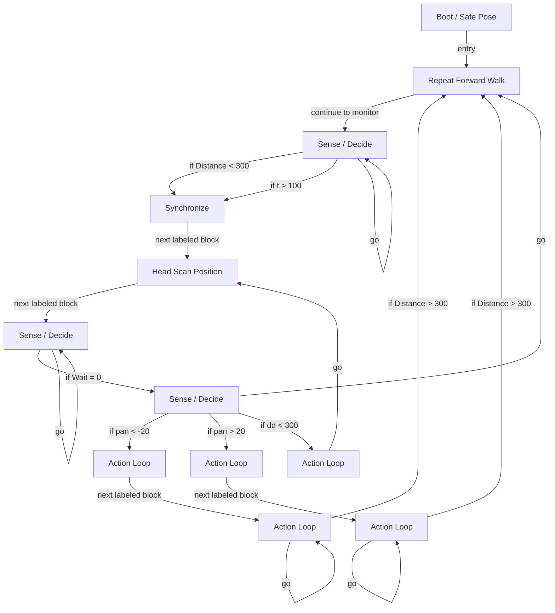

# R-Code Behavior Extract: `Guru3.R`

## Summary

- category: `Behavior`
- family: `Guru`
- variant: `v3`
- source: `src/R-CODE/sample/Guru3.R`
- states: `12`
- transitions: `21`
- commands: `MOVE=10, WAIT=9, IF=9, SET=6, GO=6, POSE=2, PLAY=2, ADD=1`
- sensed variables: `Distance, Head_pan, Wait`

## State Blocks

- `Boot / Safe Pose`: Boot, Assume Safe Pose, Synchronize
  lines 5: `SET:Power:1`
  lines 6: `POSE:AIBO:oStanding`
  lines 7: `WAIT`
- `Repeat Forward Walk`: Initialize State, Act, Synchronize
  lines 11: `MOVE:HEAD:ABS:0:0:0:1000`
  lines 12: `WAIT`
  lines 13: `MOVE:LEGS:WALK:0:FORWARD:0`
  lines 15: `SET:t:0`
- `Sense / Decide`: Sense/Decide, Synchronize, Loop/Transition
  lines 17: `IF:<:Distance:300:120`
  lines 18: `WAIT:1`
  lines 19: `ADD:t:1`
  lines 20: `IF:>:t:100:120`
  lines 21: `GO:110`
- `Synchronize`: Assume Safe Pose, Act, Synchronize
  lines 25: `PLAY:LEGS:WalkToWS`
  lines 26: `POSE:AIBO:oStanding`
  lines 27: `WAIT`
- `Head Scan Position`: Initialize State, Act
  lines 30: `MOVE:HEAD:ABS:0:-90:0:1000`
  lines 31: `MOVE:HEAD:ABS:0:90:0:2000`
  lines 32: `MOVE:HEAD:ABS:0:0:0:1000`
  lines 33: `SET:dd:0`
- `Sense / Decide`: Initialize State, Sense/Decide, Loop/Transition
  lines 35: `IF:=:Wait:0:132`
  lines 36: `SET:d:Distance`
  lines 37: `IF:<:d:dd:131`
  lines 38: `SET:dd:d`
  lines 39: `SET:pan:Head_pan`
  ... `1` more instructions
- `Sense / Decide`: Sense/Decide, Loop/Transition
  lines 42: `IF:<:pan:-20:200`
  lines 43: `IF:>:pan:20:300`
  lines 44: `IF:<:dd:300:133`
  lines 45: `GO:100`
- `Action Loop`: Act, Synchronize, Loop/Transition
  lines 48: `PLAY:SOUND:ang1_xxa:100`
  lines 49: `MOVE:LEGS:STEP:11:0:10`
  lines 50: `WAIT`
  lines 51: `GO:130`
- `Action Loop`: Act, Synchronize
  lines 54: `MOVE:HEAD:ABS:-30:0:0:1000`
  lines 55: `WAIT`
- `Action Loop`: Sense/Decide, Act, Synchronize, Loop/Transition
  lines 57: `MOVE:LEGS:STEP:12:0:4`
  lines 58: `WAIT`
  lines 59: `IF:>:Distance:300:100`
  lines 60: `GO:210`
- `Action Loop`: Act, Synchronize
  lines 63: `MOVE:HEAD:ABS:-30:0:0:1000`
  lines 64: `WAIT`
- `Action Loop`: Sense/Decide, Act, Synchronize, Loop/Transition
  lines 66: `MOVE:LEGS:STEP:13:0:4`
  lines 67: `WAIT`
  lines 68: `IF:>:Distance:300:100`
  lines 69: `GO:310`

## Transitions

- `INIT` -> `100`: entry
- `100` -> `110`: continue to monitor
- `110` -> `120`: if Distance < 300
- `110` -> `120`: if t > 100
- `110` -> `110`: go
- `120` -> `130`: next labeled block
- `130` -> `131`: next labeled block
- `131` -> `132`: if Wait = 0
- `131` -> `131`: if d < dd
- `131` -> `131`: go
- `132` -> `200`: if pan < -20
- `132` -> `300`: if pan > 20
- `132` -> `133`: if dd < 300
- `132` -> `100`: go
- `133` -> `130`: go
- `200` -> `210`: next labeled block
- `210` -> `100`: if Distance > 300
- `210` -> `210`: go
- `300` -> `310`: next labeled block
- `310` -> `100`: if Distance > 300
- `310` -> `310`: go

## Mermaid

