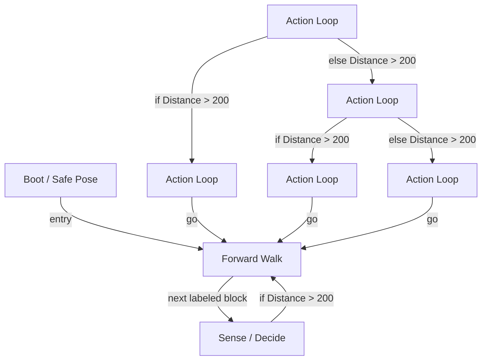

# R-Code Behavior Extract: `Guru1.R`

## Summary

- category: `Behavior`
- source: `src/R-CODE/sample/Guru1.R`
- states: `8`
- transitions: `10`
- commands: `MOVE=8, WAIT=7, SET=6, POSE=6, IF=3, GO=3`
- sensed variables: `Distance`

## State Blocks

- `Boot / Safe Pose`: Boot, Assume Safe Pose
  lines 5: `SET:Power:1`
  lines 6: `POSE:AIBO:slp_slp`
- `Forward Walk`: Act
  lines 10: `MOVE:LEGS:WALK:0:FORWARD:0`
- `Sense / Decide`: Initialize State, Sense/Decide
  lines 13: `IF:>:Distance:200:100`
  lines 14: `SET:label:110`
- `Action Loop`: Assume Safe Pose, Sense/Decide, Act, Synchronize
  lines 18: `POSE:AIBO:oStanding`
  lines 19: `WAIT`
  lines 20: `MOVE:HEAD:ABS:30:-90:-90:500`
  lines 21: `WAIT`
  lines 22: `IF:>:Distance:200:130:140`
- `Action Loop`: Initialize State, Assume Safe Pose, Act, Synchronize, Loop/Transition
  lines 26: `SET:label:130`
  lines 27: `POSE:AIBO:oStanding`
  lines 28: `WAIT`
  lines 29: `MOVE:LEGS:STEP:RIGHT_TURN:0:15`
  lines 30: `MOVE:HEAD:ABS:0:0:0:1000`
  ... `1` more instructions
- `Action Loop`: Initialize State, Assume Safe Pose, Sense/Decide, Act, Synchronize
  lines 35: `SET:label:140`
  lines 36: `POSE:AIBO:oStanding`
  lines 37: `WAIT`
  lines 38: `MOVE:HEAD:ABS:30:90:90:500`
  lines 39: `WAIT`
  ... `1` more instructions
- `Action Loop`: Initialize State, Assume Safe Pose, Act, Synchronize, Loop/Transition
  lines 44: `SET:label:160`
  lines 45: `POSE:AIBO:oStanding`
  lines 46: `WAIT`
  lines 47: `MOVE:LEGS:STEP:LEFT_TURN:0:15`
  lines 48: `MOVE:HEAD:ABS:0:0:0:1000`
  ... `1` more instructions
- `Action Loop`: Initialize State, Assume Safe Pose, Act, Synchronize, Loop/Transition
  lines 53: `SET:label:170`
  lines 54: `POSE:AIBO:oStanding`
  lines 55: `WAIT`
  lines 56: `MOVE:LEGS:STEP:RIGHT_TURN:0:20`
  lines 57: `GO:100`

## Transitions

- `INIT` -> `100`: entry
- `100` -> `110`: next labeled block
- `110` -> `100`: if Distance > 200
- `120` -> `130`: if Distance > 200
- `120` -> `140`: else Distance > 200
- `130` -> `100`: go
- `140` -> `160`: if Distance > 200
- `140` -> `170`: else Distance > 200
- `160` -> `100`: go
- `170` -> `100`: go

## Mermaid

