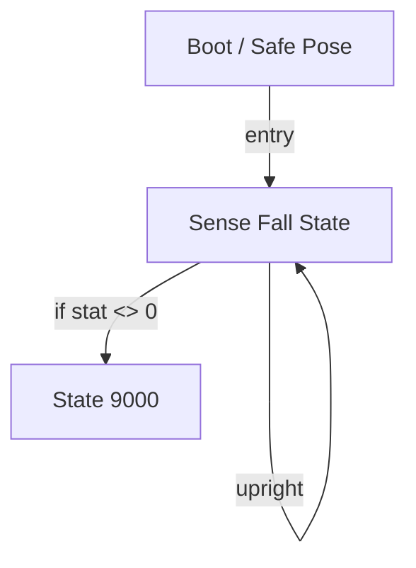

# R-Code Behavior Extract: `HoldupDog.R`

## Summary

- source: `src/R-CODE/sample/HoldupDog.R`
- states: `3`
- transitions: `3`
- commands: `SET=2, PLAY=2, POSE=1, AND=1, IF=1, GO=1`
- sensed variables: `Gsensor_status`

## State Blocks

- `Boot / Safe Pose`: Boot, Assume Safe Pose
  lines 5: `SET:Power:1`
  lines 6: `POSE:AIBO:slp_slp`
- `Sense Fall State`: Initialize State, Sense/Decide, Loop/Transition
  lines 10: `SET:stat:Gsensor_status`
  lines 11: `AND:stat:2`
  lines 12: `IF:<>:stat:0:9000`
  lines 13: `GO:100`
- `State 9000`: Act
  lines 16: `PLAY:SOUND:joy2_xxt:50`
  lines 17: `PLAY:LIGHT:joy4_eye:16`

## Transitions

- `INIT` -> `100`: entry
- `100` -> `9000`: if stat <> 0
- `100` -> `100`: upright

## Mermaid

