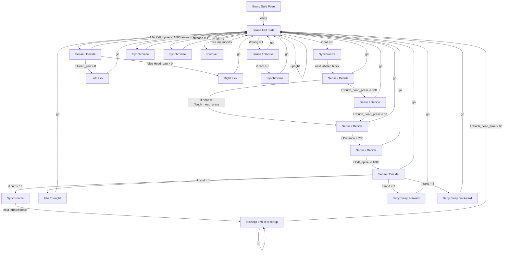

# R-Code Behavior Extract: `HyperBabyDog.R`

## Summary

- source: `src/R-CODE/sample/HyperBabyDog.R`
- states: `21`
- transitions: `40`
- commands: `SET=30, IF=19, GO=17, PLAY=11, MOVE=10, WAIT=9, POSE=3, ADD=3, AND=1, RND=1`
- sensed variables: `Cdt_npixel, Distance, Gsensor_status, Head_pan, Touch_head_press, Touch_head_time`

## State Blocks

- `Boot / Safe Pose`: Boot, Assume Safe Pose
  lines 8: `SET:Power:1`
  lines 9: `POSE:AIBO:slp_slp`
  lines 11: `SET:ball:0`
  lines 12: `SET:bang:0`
  lines 13: `SET:nade:0`
  ... `5` more instructions
- `Sense Fall State`: Initialize State, Sense/Decide, Loop/Transition
  lines 22: `SET:fall:Gsensor_status`
  lines 23: `AND:fall:1`
  lines 25: `SET:start:100`
  lines 27: `IF:=:fall:1:9000`
  lines 28: `IF:=:ball:1:2000`
  ... `5` more instructions
- `Synchronize`: Initialize State, Synchronize
  lines 38: `WAIT:5000`
  lines 39: `SET:ball:0`
- `Sense / Decide`: Initialize State, Sense/Decide, Loop/Transition
  lines 42: `IF:=:head:Touch_head_press:1300`
  lines 43: `SET:head:Touch_head_press`
  lines 44: `IF:<:Touch_head_press:300:1200`
  lines 45: `SET:bang:1`
  lines 46: `GO:100`
- `Sense / Decide`: Initialize State, Sense/Decide, Loop/Transition
  lines 48: `IF:<:Touch_head_press:30:1300`
  lines 49: `SET:nade:1`
  lines 50: `GO:100`
- `Sense / Decide`: Initialize State, Sense/Decide, Loop/Transition
  lines 53: `IF:>:Distance:200:1400`
  lines 54: `SET:amae:1`
  lines 55: `GO:100`
- `Sense / Decide`: Initialize State, Sense/Decide, Loop/Transition
  lines 58: `IF:<:Cdt_npixel:1000:1500`
  lines 59: `SET:ball:1`
  lines 60: `GO:100`
- `Sense / Decide`: Sense/Decide, Loop/Transition
  lines 64: `ADD:cntr:1`
  lines 65: `IF:>:cntr:10:1510`
  lines 66: `RND:rand:1:3`
  lines 67: `IF:=:rand:1:1530`
  lines 68: `IF:=:rand:2:1540`
  ... `2` more instructions
- `Synchronize`: Initialize State, Assume Safe Pose, Act, Synchronize
  lines 74: `SET:cntr:0`
  lines 75: `PLAY:AIBO:Akubi_slp_D`
  lines 76: `POSE:AIBO:oSleeping5`
  lines 77: `WAIT`
- `It sleeps until it is set up`: Sense/Decide, Loop/Transition
  lines 80: `IF:>:Touch_head_time:80:100`
  lines 81: `GO:1520`
- `Idle Thought`: Act, Loop/Transition
  lines 85: `PLAY:AIBO:Think_slp_C`
  lines 86: `GO:100`
- `Baby Sway Forward`: Act, Loop/Transition
  lines 90: `MOVE:LEGS:STEP:BABY:FORWARD:10`
  lines 91: `GO:100`
- `Baby Sway Backward`: Act, Loop/Transition
  lines 95: `MOVE:LEGS:STEP:BABY:BACKWARD:10`
  lines 96: `GO:100`
- `Sense / Decide`: Initialize State, Sense/Decide, Act
  lines 101: `SET:ball:1`
  lines 103: `IF:<:Cdt_npixel:1000:100`
  lines 104: `MOVE:HEAD:C-TRACKING:100`
  lines 105: `IF:>:Head_pan:0:2100:2200`
- `Left Kick`: Initialize State, Act, Loop/Transition
  lines 109: `MOVE:HEAD:HOME`
  lines 110: `MOVE:LEGS:KICK:LEFT_KICK:0`
  lines 111: `MOVE:LEGS:STEP:BABY:FORWARD:1`
  lines 112: `SET:ball:2100`
  lines 113: `SET:ball:0`
  ... `1` more instructions
- `Right Kick`: Initialize State, Act, Loop/Transition
  lines 118: `MOVE:HEAD:HOME`
  lines 119: `MOVE:LEGS:KICK:RIGHT_KICK:0`
  lines 120: `MOVE:LEGS:STEP:BABY:FORWARD:1`
  lines 121: `SET:ball:2200`
  lines 122: `SET:ball:0`
  ... `1` more instructions
- `Sense / Decide`: Initialize State, Assume Safe Pose, Sense/Decide, Act, Synchronize, Loop/Transition
  lines 129: `SET:bang:3000`
  lines 130: `SET:bang:0`
  lines 131: `ADD:cntb:1`
  lines 132: `IF:>:cntb:3:3100`
  lines 133: `POSE:AIBO:Reset3`
  ... `6` more instructions
- `Synchronize`: Initialize State, Act, Synchronize, Loop/Transition
  lines 145: `PLAY:AIBO:Tail3_sta`
  lines 146: `WAIT`
  lines 147: `PLAY:SOUND:ang5_dda:30`
  lines 148: `PLAY:LIGHT:ang1_eye:4`
  lines 149: `WAIT:5000`
  ... `2` more instructions
- `Synchronize`: Initialize State, Act, Synchronize, Loop/Transition
  lines 157: `SET:amae:0`
  lines 158: `PLAY:AIBO:Please_sit3`
  lines 159: `WAIT:5000`
  lines 160: `GO:100`
- `Synchronize`: Initialize State, Act, Synchronize, Loop/Transition
  lines 166: `ADD:cntb:-1`
  lines 167: `SET:nade:0`
  lines 168: `PLAY:LIGHT:joy3_eye:10`
  lines 169: `PLAY:AIBO:Tail2_sit`
  lines 170: `PLAY:SOUND:joy1rxxy:50`
  ... `3` more instructions
- `Recover`: Act, Synchronize, Recover, Loop/Transition
  lines 178: `QUIT:AIBO`
  lines 179: `MOVE:AIBO:ReactiveGU`
  lines 180: `WAIT`
  lines 181: `GO:100`

## Transitions

- `INIT` -> `100`: entry
- `100` -> `9000`: if fall = 1
- `100` -> `2000`: if ball = 1
- `100` -> `3000`: if bang = 1
- `100` -> `4000`: if amae = 1
- `100` -> `5000`: if nade = 1
- `100` -> `1000`: if ball = 0
- `100` -> `100`: upright
- `1000` -> `1100`: next labeled block
- `1100` -> `1300`: if head = Touch_head_press
- `1100` -> `1200`: if Touch_head_press < 300
- `1100` -> `100`: go
- `1200` -> `1300`: if Touch_head_press < 30
- `1200` -> `100`: go
- `1300` -> `1400`: if Distance > 200
- `1300` -> `100`: go
- `1400` -> `1500`: if Cdt_npixel < 1000
- `1400` -> `100`: go
- `1500` -> `1510`: if cntr > 10
- `1500` -> `1530`: if rand = 1
- `1500` -> `1540`: if rand = 2
- `1500` -> `1550`: if rand = 3
- `1500` -> `100`: go
- `1510` -> `1520`: next labeled block
- `1520` -> `100`: if Touch_head_time > 80
- `1520` -> `1520`: go
- `1530` -> `100`: go
- `1540` -> `100`: go
- `1550` -> `100`: go
- `2000` -> `100`: if Cdt_npixel < 1000
- `2000` -> `2100`: if Head_pan > 0
- `2000` -> `2200`: else Head_pan > 0
- `2100` -> `100`: go
- `2200` -> `100`: go
- `3000` -> `3100`: if cntb > 3
- `3000` -> `100`: go
- `3100` -> `100`: go
- `4000` -> `100`: go
- `5000` -> `100`: go
- `9000` -> `100`: resume monitor

## Mermaid

