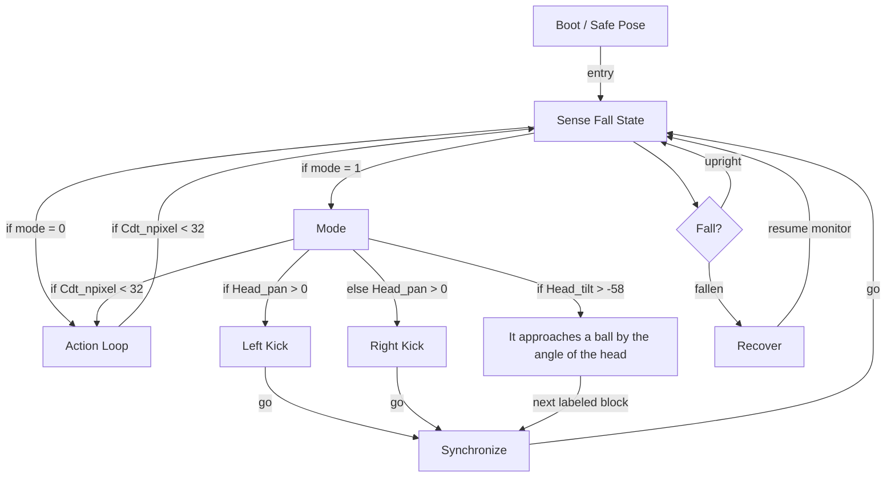

# R-Code Behavior Extract: `HyperSoccerDog.R`

## Summary

- category: `Behavior`
- source: `src/R-CODE/sample/HyperSoccerDog.R`
- states: `9`
- transitions: `15`
- commands: `CASE=16, MOVE=9, SET=7, IF=7, CSET=7, GO=5, WAIT=3, PLAY=3, QUIT=2, POSE=1`
- sensed variables: `Cdt_npixel, Gsensor_status, Head_pan, Head_tilt`

## State Blocks

- `Boot / Safe Pose`: Boot, Assume Safe Pose
  lines 5: `SET:Power:1`
  lines 6: `POSE:AIBO:slp_slp`
  lines 8: `SET:mode:0`
  lines 9: `SET:head:0`
  lines 10: `SET:lost:0`
- `Sense Fall State`: Initialize State, Sense/Decide, Loop/Transition
  lines 13: `SET:stat:Gsensor_status`
  lines 14: `AND:stat:1`
  lines 15: `IF:=:stat:1:9000`
  lines 16: `IF:=:mode:0:1000`
  lines 17: `IF:=:mode:1:2000`
  ... `1` more instructions
- `Action Loop`: Initialize State, Sense/Decide, Act, Synchronize
  lines 21: `SET:mode:0`
  lines 22: `MOVE:LEGS:STEP:RIGHT_TURN:0:4`
  lines 23: `SWITCH:head`
  lines 24: `CASE:0:MOVE:HEAD:ABS:-15:0:0:500`
  lines 25: `CASE:1:MOVE:HEAD:ABS:-15:-40:0:500`
  ... `11` more instructions
- `Mode`: Initialize State, Sense/Decide, Act
  lines 39: `SET:mode:1`
  lines 40: `IF:<:Cdt_npixel:32:1000`
  lines 42: `MOVE:HEAD:C-TRACKING:100`
  lines 43: `PLAY:LIGHT:hppy1eye:0`
  lines 44: `PLAY:SOUND:bow1_ddp:50`
  ... `3` more instructions
- `Left Kick`: Act, Loop/Transition
  lines 50: `MOVE:HEAD:HOME`
  lines 51: `MOVE:LEGS:KICK:LEFT_KICK:0`
  lines 52: `MOVE:LEGS:STEP:SLOW:FORWARD:1`
  lines 53: `GO:2900`
- `Right Kick`: Act, Loop/Transition
  lines 55: `MOVE:HEAD:HOME`
  lines 56: `MOVE:LEGS:KICK:RIGHT_KICK:0`
  lines 57: `MOVE:LEGS:STEP:SLOW:FORWARD:1`
  lines 58: `GO:2900`
- `It approaches a ball by the angle of the head`: Sense/Decide
  lines 61: `CSET:>:Head_pan:60:1`
  lines 62: `CSET:>:Head_pan:45:2`
  lines 63: `CSET:>:Head_pan:15:3`
  lines 64: `CSET:<:Head_pan:-60:4`
  lines 65: `CSET:<:Head_pan:-45:5`
  ... `9` more instructions
- `Synchronize`: Act, Synchronize, Recover, Loop/Transition
  lines 77: `QUIT:LIGHT`
  lines 78: `WAIT`
  lines 79: `GO:100`
- `Recover`: Act, Synchronize, Recover, Loop/Transition
  lines 82: `QUIT:AIBO`
  lines 83: `MOVE:AIBO:ReactiveGU`
  lines 84: `WAIT`
  lines 85: `GO:100`

## Transitions

- `INIT` -> `100`: entry
- `100` -> `9000`: fallen
- `100` -> `1000`: if mode = 0
- `100` -> `2000`: if mode = 1
- `100` -> `100`: upright
- `1000` -> `100`: if Cdt_npixel < 32
- `2000` -> `1000`: if Cdt_npixel < 32
- `2000` -> `2300`: if Head_tilt > -58
- `2000` -> `2210`: if Head_pan > 0
- `2000` -> `2220`: else Head_pan > 0
- `2210` -> `2900`: go
- `2220` -> `2900`: go
- `2300` -> `2900`: next labeled block
- `2900` -> `100`: go
- `9000` -> `100`: resume monitor

## Mermaid

