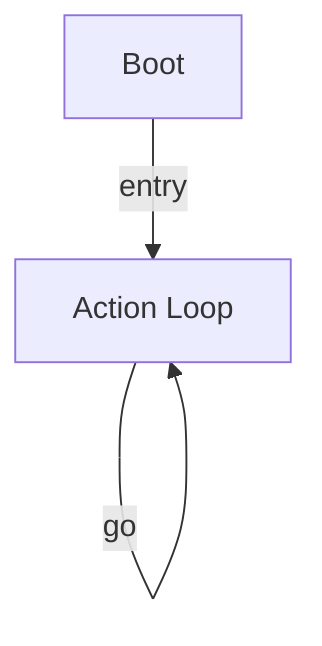

# R-Code Behavior Extract: `KickDog.R`

## Summary

- category: `Behavior`
- source: `src/R-CODE/sample/KickDog.R`
- states: `2`
- transitions: `2`
- commands: `MOVE=6, WAIT=6, SET=1, GO=1`

## State Blocks

- `Boot`: Boot
  lines 5: `SET:Power:1`
- `Action Loop`: Act, Synchronize, Loop/Transition
  lines 8: `MOVE:LEGS:KICK:RIGHT_KICK:0`
  lines 9: `WAIT`
  lines 11: `MOVE:LEGS:KICK:RIGHT_KICK:-30`
  lines 12: `WAIT`
  lines 14: `MOVE:LEGS:KICK:RIGHT_KICK:-60`
  ... `8` more instructions

## Transitions

- `INIT` -> `100`: entry
- `100` -> `100`: go

## Mermaid

