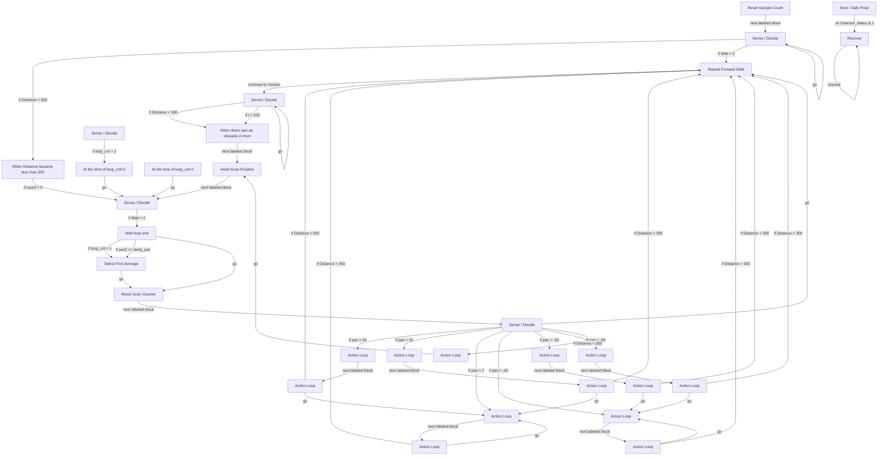

# R-Code Behavior Extract: `Maze2.R`

## Summary

- category: `Behavior`
- family: `Maze`
- variant: `v2`
- source: `src/R-CODE/sample/Maze2.R`
- states: `30`
- transitions: `49`
- commands: `IF=22, MOVE=19, WAIT=18, GO=14, LET=6, SET=5, ADD=4, POSE=3, PLAY=2, DIV=2`
- sensed variables: `Distance, Gsensor_status, Head_pan, Wait`

## State Blocks

- `Boot / Safe Pose`: Boot, Assume Safe Pose, Sense/Decide, Synchronize, Loop/Transition
  lines 5: `SET:Power:1`
  lines 6: `SET:loop_cnt:0`
  lines 7: `SET:pan_sum:0`
  lines 9: `ONCALL:&:Gsensor_status:1:9000`
  lines 10: `POSE:AIBO:oStanding`
  ... `1` more instructions
- `Repeat Forward Walk`: Initialize State, Assume Safe Pose, Act, Synchronize
  lines 15: `POSE:AIBO:oStanding`
  lines 16: `WAIT`
  lines 17: `MOVE:LEGS:WALK:0:FORWARD:0`
  lines 19: `SET:t:0`
- `Sense / Decide`: Sense/Decide, Synchronize, Loop/Transition
  lines 22: `IF:<:Distance:300:120`
  lines 23: `WAIT:1`
  lines 24: `ADD:t:1`
  lines 25: `IF:>:t:100:120`
  lines 26: `GO:110`
- `When there was an obstacle in front`: Assume Safe Pose, Act, Synchronize
  lines 29: `PLAY:LEGS:WalkToWS`
  lines 30: `POSE:AIBO:oStanding`
  lines 31: `WAIT`
- `Head Scan Position`: Act
  lines 34: `MOVE:HEAD:ABS:0:-90:0:1000`
  lines 35: `MOVE:HEAD:ABS:0:0:0:1000`
  lines 36: `MOVE:HEAD:ABS:0:90:0:1000`
  lines 37: `MOVE:HEAD:ABS:0:0:0:1000`
- `Sense / Decide`: Sense/Decide
  lines 40: `IF:=:Wait:0:1100`
- `Reset Sample Count`: Initialize State
  lines 43: `SET:count:0`
- `Sense / Decide`: Sense/Decide, Loop/Transition
  lines 45: `IF:<:Distance:300:1040`
  lines 46: `ADD:pan_sum:Head_pan`
  lines 47: `ADD:count:1`
  lines 48: `IF:=:Wait:0:100`
  lines 49: `GO:1020`
- `When Distance became less than 300`: Sense/Decide
  lines 52: `IF:=:count:0:1010`
- `Sense / Decide`: Sense/Decide
  lines 54: `ADD:loop_cnt:1`
  lines 55: `IF:=:loop_cnt:2:1043`
- `At the time of loop_cnt=1`: Loop/Transition
  lines 57: `DIV:pan_sum:count`
  lines 58: `LET:ave1:pan_sum`
  lines 59: `GO:1010`
- `At the time of loop_cnt=2`: Loop/Transition
  lines 61: `DIV:pan_sum:count`
  lines 62: `LET:ave2:pan_sum`
  lines 63: `GO:1010`
- `Wait loop end`: Sense/Decide, Loop/Transition
  lines 66: `IF:=:loop_cnt:1:1110`
  lines 68: `LET:temp_ave:ave1`
  lines 69: `MUL:temp_ave:-1`
  lines 70: `IF:<=:ave2:temp_ave:1110`
  lines 71: `LET:pan:ave2`
  ... `1` more instructions
- `Select First Average`: Loop/Transition
  lines 74: `LET:pan:ave1`
  lines 75: `GO:1200`
- `Reset Scan Counter`: Action
  lines 77: `LET:loop_cnt:0`
- `Sense / Decide`: Sense/Decide, Loop/Transition
  lines 80: `IF:>:pan:50:3010`
  lines 81: `IF:>:pan:20:3020`
  lines 82: `IF:>:pan:0:3030`
  lines 83: `IF:>:pan:-20:2030`
  lines 84: `IF:>:pan:-50:2020`
  ... `3` more instructions
- `Action Loop`: Act, Synchronize, Loop/Transition
  lines 90: `PLAY:SOUND:ang1_xxa:100`
  lines 91: `MOVE:LEGS:STEP:11:0:10`
  lines 92: `WAIT`
  lines 93: `GO:130`
- `Action Loop`: Act, Synchronize
  lines 96: `MOVE:HEAD:ABS:0:0:0:1000`
  lines 97: `WAIT`
- `Action Loop`: Sense/Decide, Act, Synchronize, Loop/Transition
  lines 99: `MOVE:LEGS:STEP:12:0:6`
  lines 100: `WAIT`
  lines 101: `IF:>:Distance:300:100`
  lines 102: `GO:2030`
- `Action Loop`: Act, Synchronize
  lines 105: `MOVE:HEAD:ABS:0:0:0:1000`
  lines 106: `WAIT`
- `Action Loop`: Sense/Decide, Act, Synchronize, Loop/Transition
  lines 108: `MOVE:LEGS:STEP:12:0:4`
  lines 109: `WAIT`
  lines 110: `IF:>:Distance:300:100`
  lines 111: `GO:2030`
- `Action Loop`: Act, Synchronize
  lines 114: `MOVE:HEAD:ABS:0:0:0:1000`
  lines 115: `WAIT`
- `Action Loop`: Sense/Decide, Act, Synchronize, Loop/Transition
  lines 117: `MOVE:LEGS:STEP:12:0:2`
  lines 118: `WAIT`
  lines 119: `IF:>:Distance:300:100`
  lines 120: `GO:2030`
- `Action Loop`: Act, Synchronize
  lines 123: `MOVE:HEAD:ABS:0:0:0:1000`
  lines 124: `WAIT`
- `Action Loop`: Sense/Decide, Act, Synchronize, Loop/Transition
  lines 126: `MOVE:LEGS:STEP:13:0:6`
  lines 127: `WAIT`
  lines 128: `IF:>:Distance:300:100`
  lines 129: `GO:3030`
- `Action Loop`: Act, Synchronize
  lines 132: `MOVE:HEAD:ABS:0:0:0:1000`
  lines 133: `WAIT`
- `Action Loop`: Sense/Decide, Act, Synchronize, Loop/Transition
  lines 135: `MOVE:LEGS:STEP:13:0:4`
  lines 136: `WAIT`
  lines 137: `IF:>:Distance:300:100`
  lines 138: `GO:3030`
- `Action Loop`: Act, Synchronize
  lines 141: `MOVE:HEAD:ABS:0:0:0:1000`
  lines 142: `WAIT`
- `Action Loop`: Sense/Decide, Act, Synchronize, Loop/Transition
  lines 144: `MOVE:LEGS:STEP:13:0:2`
  lines 145: `WAIT`
  lines 146: `IF:>:Distance:300:100`
  lines 147: `GO:3030`
- `Recover`: Act, Synchronize, Recover, Loop/Transition
  lines 151: `QUIT:AIBO`
  lines 152: `MOVE:AIBO:ReactiveGU`
  lines 153: `WAIT`
  lines 154: `RESUME`

## Transitions

- `INIT` -> `9000`: on Gsensor_status & 1
- `100` -> `110`: continue to monitor
- `110` -> `120`: if Distance < 300
- `110` -> `120`: if t > 100
- `110` -> `110`: go
- `120` -> `130`: next labeled block
- `130` -> `1010`: next labeled block
- `1010` -> `1100`: if Wait = 0
- `1011` -> `1020`: next labeled block
- `1020` -> `1040`: if Distance < 300
- `1020` -> `100`: if Wait = 0
- `1020` -> `1020`: go
- `1040` -> `1010`: if count = 0
- `1041` -> `1043`: if loop_cnt = 2
- `1042` -> `1010`: go
- `1043` -> `1010`: go
- `1100` -> `1110`: if loop_cnt = 1
- `1100` -> `1110`: if ave2 <= temp_ave
- `1100` -> `1200`: go
- `1110` -> `1200`: go
- `1200` -> `2000`: next labeled block
- `2000` -> `3010`: if pan > 50
- `2000` -> `3020`: if pan > 20
- `2000` -> `3030`: if pan > 0
- `2000` -> `2030`: if pan > -20
- `2000` -> `2020`: if pan > -50
- `2000` -> `2010`: if pan > -90
- `2000` -> `133`: if Distance < 300
- `2000` -> `100`: go
- `133` -> `130`: go
- `2010` -> `2011`: next labeled block
- `2011` -> `100`: if Distance > 300
- `2011` -> `2030`: go
- `2020` -> `2021`: next labeled block
- `2021` -> `100`: if Distance > 300
- `2021` -> `2030`: go
- `2030` -> `2031`: next labeled block
- `2031` -> `100`: if Distance > 300
- `2031` -> `2030`: go
- `3010` -> `3011`: next labeled block
- `3011` -> `100`: if Distance > 300
- `3011` -> `3030`: go
- `3020` -> `3021`: next labeled block
- `3021` -> `100`: if Distance > 300
- `3021` -> `3030`: go
- `3030` -> `3031`: next labeled block
- `3031` -> `100`: if Distance > 300
- `3031` -> `3030`: go
- `9000` -> `9000`: resume

## Mermaid

