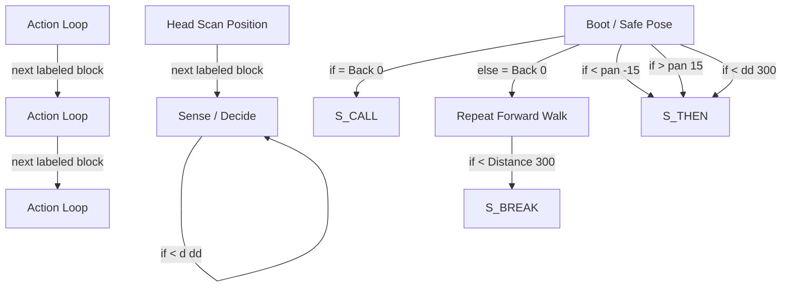

# R-Code Behavior Extract: `Maze3.R`

## Summary

- category: `Behavior`
- family: `Maze`
- variant: `v3`
- source: `src/R-CODE/sample/Maze3.R`
- states: `7`
- transitions: `10`
- commands: `WAIT=12, MOVE=11, SET=9, IF=6, RETURN=6, CALL=5, DO=4, LOOP=4, ELSE=3, ENDIF=3`
- sensed variables: `Distance, Head_pan, Wait`

## State Blocks

- `Boot / Safe Pose`: Boot, Assume Safe Pose, Sense/Decide
  lines 5: `SET:Power:1`
  lines 6: `POSE:AIBO:slp_slp`
  lines 8: `SET:Back:0`
  lines 11: `DO`
  lines 12: `IF:Back:=:0:CALL:100`
  ... `18` more instructions
- `Repeat Forward Walk`: Assume Safe Pose, Sense/Decide, Act, Synchronize
  lines 37: `POSE:AIBO:oStanding`
  lines 38: `WAIT`
  lines 39: `MOVE:HEAD:ABS:0:0:0:1000`
  lines 40: `WAIT`
  lines 41: `MOVE:LEGS:WALK:0:FORWARD:0`
  ... `7` more instructions
- `Head Scan Position`: Act
  lines 55: `MOVE:HEAD:ABS:0:0:0:1000`
  lines 56: `MOVE:HEAD:ABS:0:-90:0:1000`
  lines 57: `MOVE:HEAD:ABS:0:90:0:2000`
  lines 58: `MOVE:HEAD:ABS:0:0:0:1000`
  lines 59: `RETURN`
- `Sense / Decide`: Initialize State, Sense/Decide
  lines 62: `DO:WHILE:<>:Wait:0`
  lines 63: `SET:d:Distance`
  lines 64: `SET:p:Head_pan`
  lines 65: `IF:d:<:dd:300`
  lines 66: `SET:dd:d`
  ... `3` more instructions
- `Action Loop`: Act, Synchronize
  lines 72: `MOVE:HEAD:ABS:0:0:0:1000`
  lines 73: `WAIT`
  lines 74: `DO`
  lines 75: `MOVE:LEGS:STEP:12:0:1`
  lines 76: `WAIT`
  ... `3` more instructions
- `Action Loop`: Act, Synchronize
  lines 82: `MOVE:HEAD:ABS:0:0:0:1000`
  lines 83: `WAIT`
  lines 84: `DO`
  lines 85: `MOVE:LEGS:STEP:13:0:1`
  lines 86: `WAIT`
  ... `3` more instructions
- `Action Loop`: Act, Synchronize
  lines 92: `PLAY:SOUND:ang1_xxa:100`
  lines 93: `MOVE:LEGS:STEP:11:0:10`
  lines 94: `WAIT`
  lines 95: `WAIT:1000`
  lines 96: `RETURN`

## Transitions

- `INIT` -> `CALL`: if = Back 0
- `INIT` -> `100`: else = Back 0
- `INIT` -> `THEN`: if < pan -15
- `INIT` -> `THEN`: if > pan 15
- `INIT` -> `THEN`: if < dd 300
- `100` -> `BREAK`: if < Distance 300
- `200` -> `300`: next labeled block
- `300` -> `300`: if < d dd
- `400` -> `500`: next labeled block
- `500` -> `600`: next labeled block

## Mermaid

