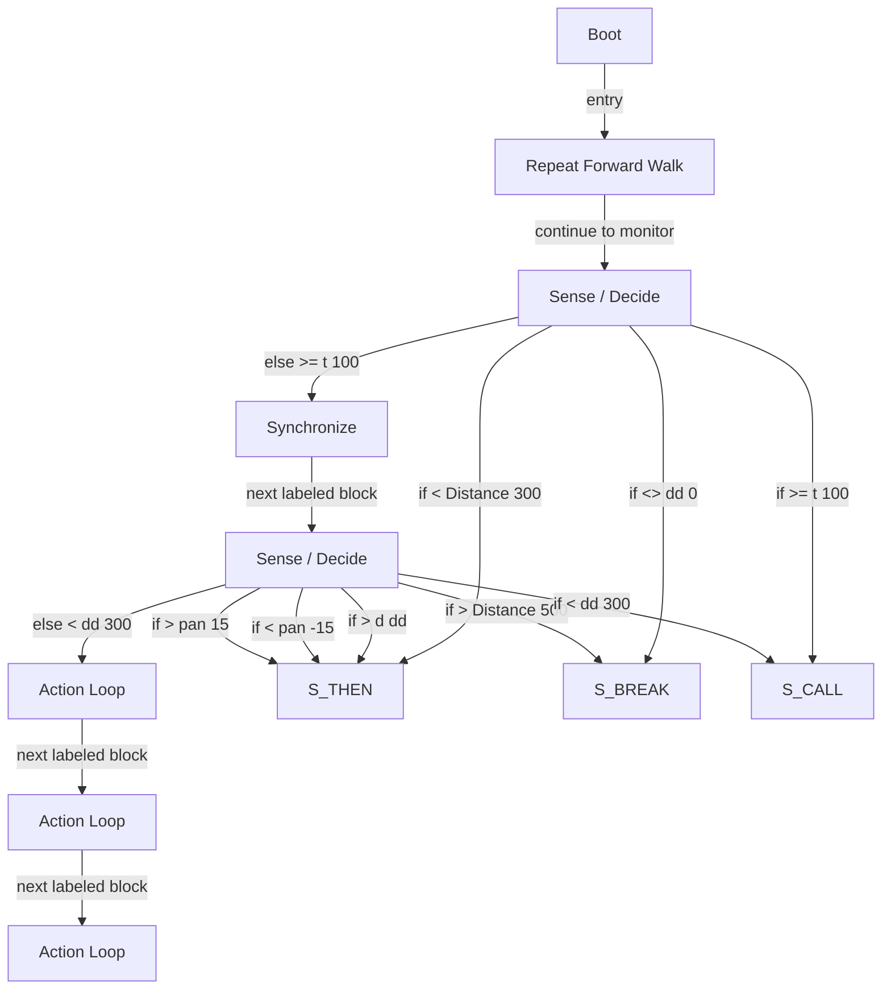

# R-Code Behavior Extract: `Maze4.R`

## Summary

- category: `Behavior`
- family: `Maze`
- variant: `v4`
- source: `src/R-CODE/sample/Maze4.R`
- states: `8`
- transitions: `15`
- commands: `WAIT=11, MOVE=10, IF=10, SET=9, RETURN=6, CALL=5, WHILE=4, ELSE=4, ENDIF=4, WEND=4`
- sensed variables: `Distance, Head_pan, Wait`

## State Blocks

- `Boot`: Boot
  lines 5: `SET:Power:1`
- `Repeat Forward Walk`: Assume Safe Pose, Act, Synchronize
  lines 9: `POSE:AIBO:oStanding`
  lines 10: `WAIT:AIBO`
  lines 11: `MOVE:HEAD:ABS:0:0:0:1000`
  lines 12: `WAIT`
  lines 13: `MOVE:LEGS:WALK:0:FORWARD:0`
  ... `4` more instructions
- `Sense / Decide`: Initialize State, Sense/Decide
  lines 23: `SET:t:0`
  lines 24: `WHILE:t:<:100`
  lines 25: `IF:Distance:<:300:THEN`
  lines 26: `CALL:120`
  lines 27: `IF:dd:<>:0:BREAK`
  ... `6` more instructions
- `Synchronize`: Act, Synchronize
  lines 38: `PLAY:LEGS:WalkToWS`
  lines 39: `WAIT:LEGS`
  lines 40: `CALL:130`
  lines 41: `RETURN`
- `Sense / Decide`: Initialize State, Sense/Decide, Act
  lines 46: `SET:Wait:0`
  lines 47: `MOVE:HEAD:ABS:0:-90:0:1000`
  lines 48: `MOVE:HEAD:ABS:0:90:0:2000`
  lines 49: `MOVE:HEAD:ABS:0:0:0:1000`
  lines 50: `SET:dd:0`
  ... `23` more instructions
- `Action Loop`: Act, Synchronize
  lines 80: `PLAY:SOUND:ang1_xxa:100`
  lines 81: `MOVE:LEGS:STEP:11:0:10`
  lines 82: `WAIT`
  lines 83: `WAIT:1000`
  lines 84: `RETURN`
- `Action Loop`: Act, Synchronize
  lines 89: `MOVE:HEAD:ABS:0:0:0:1000`
  lines 90: `WAIT`
  lines 91: `WHILE:Distance:<:500`
  lines 92: `MOVE:LEGS:STEP:12:0:1`
  lines 93: `WAIT`
  ... `3` more instructions
- `Action Loop`: Act, Synchronize
  lines 101: `MOVE:HEAD:ABS:0:0:0:1000`
  lines 102: `WAIT`
  lines 103: `WHILE:Distance:<:500`
  lines 104: `MOVE:LEGS:STEP:13:0:1`
  lines 105: `WAIT`
  ... `3` more instructions

## Transitions

- `INIT` -> `100`: entry
- `100` -> `110`: continue to monitor
- `110` -> `THEN`: if < Distance 300
- `110` -> `BREAK`: if <> dd 0
- `110` -> `CALL`: if >= t 100
- `110` -> `120`: else >= t 100
- `120` -> `130`: next labeled block
- `130` -> `THEN`: if > d dd
- `130` -> `THEN`: if < pan -15
- `130` -> `BREAK`: if > Distance 500
- `130` -> `THEN`: if > pan 15
- `130` -> `CALL`: if < dd 300
- `130` -> `133`: else < dd 300
- `133` -> `200`: next labeled block
- `200` -> `300`: next labeled block

## Mermaid

