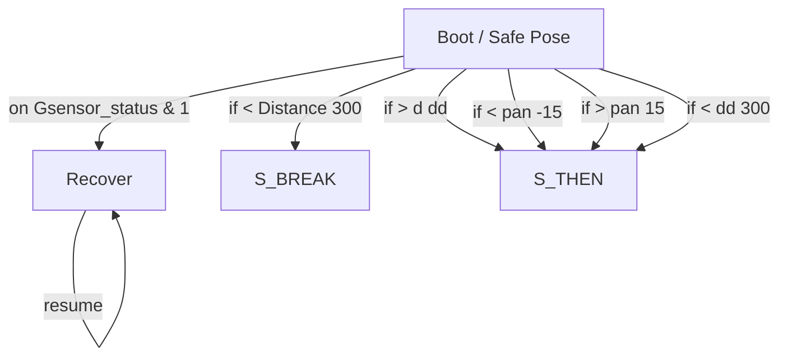

# R-Code Behavior Extract: `Maze5.R`

## Summary

- category: `Behavior`
- family: `Maze`
- variant: `v5`
- source: `src/R-CODE/sample/Maze5.R`
- states: `2`
- transitions: `7`
- commands: `WAIT=11, MOVE=10, SET=6, IF=5, ENDIF=4, PLAY=2, REPEAT=2, UNTIL=2, ONCALL=1, DO=1`
- sensed variables: `Distance, Gsensor_status, Head_pan, Wait`

## State Blocks

- `Boot / Safe Pose`: Boot, Assume Safe Pose, Sense/Decide, Act, Synchronize, Loop/Transition
  lines 5: `SET:Power:1`
  lines 7: `ONCALL:&:Gsensor_status:1:9000:2`
  lines 9: `DO`
  lines 11: `POSE:AIBO:oStanding`
  lines 12: `WAIT`
  ... `45` more instructions
- `Recover`: Act, Synchronize, Recover, Loop/Transition
  lines 68: `QUIT:AIBO`
  lines 69: `MOVE:AIBO:ReactiveGU`
  lines 70: `WAIT`
  lines 71: `RESUME`

## Transitions

- `INIT` -> `9000`: on Gsensor_status & 1
- `INIT` -> `BREAK`: if < Distance 300
- `INIT` -> `THEN`: if > d dd
- `INIT` -> `THEN`: if < pan -15
- `INIT` -> `THEN`: if > pan 15
- `INIT` -> `THEN`: if < dd 300
- `9000` -> `9000`: resume

## Mermaid

