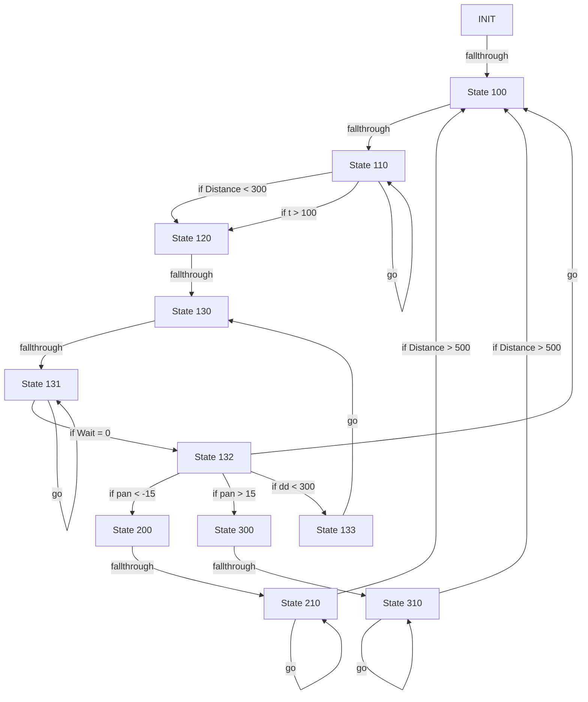

# R-Code Behavior Extract: `Maze1.R`

## Summary

- source: `src/R-CODE/sample/Maze1.R`
- states: `12`
- transitions: `21`
- commands: `WAIT=12, MOVE=11, IF=9, SET=7, GO=6, PLAY=2, POSE=1, ADD=1`
- sensed variables: `Distance, Head_pan, Wait`

## State Blocks

- `INIT`: Boot
  lines 5: `SET:Power:1`
- `State 100`: Initialize State, Assume Safe Pose, Act, Synchronize
  lines 8: `POSE:AIBO:oStanding`
  lines 9: `WAIT`
  lines 10: `MOVE:HEAD:ABS:0:0:0:1000`
  lines 11: `WAIT`
  lines 12: `MOVE:LEGS:WALK:0:FORWARD:0`
  ... `1` more instructions
- `State 110`: Sense/Decide, Synchronize, Loop/Transition
  lines 16: `IF:<:Distance:300:120`
  lines 17: `WAIT:1`
  lines 18: `ADD:t:1`
  lines 19: `IF:>:t:100:120`
  lines 20: `GO:110`
- `State 120`: Act, Synchronize
  lines 24: `PLAY:LEGS:WalkToWS`
  lines 26: `WAIT`
- `State 130`: Initialize State, Act
  lines 29: `MOVE:HEAD:ABS:0:0:0:1000`
  lines 30: `MOVE:HEAD:ABS:0:-90:0:1000`
  lines 31: `MOVE:HEAD:ABS:0:90:0:2000`
  lines 32: `MOVE:HEAD:ABS:0:0:0:1000`
  lines 33: `SET:dd:0`
- `State 131`: Initialize State, Sense/Decide, Loop/Transition
  lines 35: `IF:=:Wait:0:132`
  lines 36: `SET:d:Distance`
  lines 37: `SET:p:Head_pan`
  lines 38: `IF:<:d:dd:131`
  lines 39: `SET:dd:d`
  ... `2` more instructions
- `State 132`: Sense/Decide, Loop/Transition
  lines 43: `IF:<:pan:-15:200`
  lines 44: `IF:>:pan:15:300`
  lines 45: `IF:<:dd:300:133`
  lines 46: `GO:100`
- `State 133`: Act, Synchronize, Loop/Transition
  lines 49: `PLAY:SOUND:ang1_xxa:100`
  lines 50: `MOVE:LEGS:STEP:11:0:10`
  lines 51: `WAIT`
  lines 52: `WAIT:1000`
  lines 53: `GO:130`
- `State 200`: Act, Synchronize
  lines 56: `MOVE:HEAD:ABS:0:0:0:1000`
  lines 57: `WAIT`
- `State 210`: Sense/Decide, Act, Synchronize, Loop/Transition
  lines 59: `MOVE:LEGS:STEP:12:0:1`
  lines 60: `WAIT`
  lines 61: `WAIT:500`
  lines 62: `IF:>:Distance:500:100`
  lines 63: `GO:210`
- `State 300`: Act, Synchronize
  lines 66: `MOVE:HEAD:ABS:0:0:0:1000`
  lines 67: `WAIT`
- `State 310`: Sense/Decide, Act, Synchronize, Loop/Transition
  lines 69: `MOVE:LEGS:STEP:13:0:1`
  lines 70: `WAIT`
  lines 71: `WAIT:500`
  lines 72: `IF:>:Distance:500:100`
  lines 73: `GO:310`

## Transitions

- `INIT` -> `100`: fallthrough
- `100` -> `110`: fallthrough
- `110` -> `120`: if Distance < 300
- `110` -> `120`: if t > 100
- `110` -> `110`: go
- `120` -> `130`: fallthrough
- `130` -> `131`: fallthrough
- `131` -> `132`: if Wait = 0
- `131` -> `131`: if d < dd
- `131` -> `131`: go
- `132` -> `200`: if pan < -15
- `132` -> `300`: if pan > 15
- `132` -> `133`: if dd < 300
- `132` -> `100`: go
- `133` -> `130`: go
- `200` -> `210`: fallthrough
- `210` -> `100`: if Distance > 500
- `210` -> `210`: go
- `300` -> `310`: fallthrough
- `310` -> `100`: if Distance > 500
- `310` -> `310`: go

## Mermaid

