# R-Code Behavior Extract: `MotionRec.R`

## Summary

- category: `Decider`
- source: `src/R-CODE/sample/MotionRec.R`
- states: `19`
- transitions: `35`
- commands: `GO=15, SET=13, IF=11, REC=10, ELSE=10, ENDIF=10, LOAD_POSE=10, SAVE_POSE=10, ONCALL=7, WAIT=4`

## State Blocks

- `Boot / Safe Pose`: Boot, Assume Safe Pose, Sense/Decide, Synchronize, Loop/Transition
  lines 21: `DEF:POSE:pose:20`
  lines 23: `DEF:MOVE:move`
  lines 24: `1000:pose11`
  lines 25: `1000:pose12`
  lines 26: `1000:pose13`
  ... `20` more instructions
- `Start`: Action
  lines 53: `DO`
- `Sense / Decide`: Initialize State, Sense/Decide, Loop/Transition
  lines 55: `IF:Melody_id:=:1:THEN`
  lines 56: `SET:Melody_id:0`
  lines 57: `REC:POSE:pose:11`
  lines 58: `ELSE`
  lines 59: `GO:100`
  ... `1` more instructions
- `Sense / Decide`: Initialize State, Sense/Decide, Loop/Transition
  lines 62: `IF:Melody_id:=:1:THEN`
  lines 63: `SET:Melody_id:0`
  lines 64: `REC:POSE:pose:12`
  lines 65: `ELSE`
  lines 66: `GO:200`
  ... `1` more instructions
- `Sense / Decide`: Initialize State, Sense/Decide, Loop/Transition
  lines 69: `IF:Melody_id:=:1:THEN`
  lines 70: `SET:Melody_id:0`
  lines 71: `REC:POSE:pose:13`
  lines 72: `ELSE`
  lines 73: `GO:300`
  ... `1` more instructions
- `Sense / Decide`: Initialize State, Sense/Decide, Loop/Transition
  lines 76: `IF:Melody_id:=:1:THEN`
  lines 77: `SET:Melody_id:0`
  lines 78: `REC:POSE:pose:14`
  lines 79: `ELSE`
  lines 80: `GO:400`
  ... `1` more instructions
- `Sense / Decide`: Initialize State, Sense/Decide, Loop/Transition
  lines 83: `IF:Melody_id:=:1:THEN`
  lines 84: `SET:Melody_id:0`
  lines 85: `REC:POSE:pose:15`
  lines 86: `ELSE`
  lines 87: `GO:500`
  ... `1` more instructions
- `Sense / Decide`: Initialize State, Sense/Decide, Loop/Transition
  lines 90: `IF:Melody_id:=:1:THEN`
  lines 91: `SET:Melody_id:0`
  lines 92: `REC:POSE:pose:16`
  lines 93: `ELSE`
  lines 94: `GO:600`
  ... `1` more instructions
- `Sense / Decide`: Initialize State, Sense/Decide, Loop/Transition
  lines 97: `IF:Melody_id:=:1:THEN`
  lines 98: `SET:Melody_id:0`
  lines 99: `REC:POSE:pose:17`
  lines 100: `ELSE`
  lines 101: `GO:700`
  ... `1` more instructions
- `Sense / Decide`: Initialize State, Sense/Decide, Loop/Transition
  lines 104: `IF:Melody_id:=:1:THEN`
  lines 105: `SET:Melody_id:0`
  lines 106: `REC:POSE:pose:18`
  lines 107: `ELSE`
  lines 108: `GO:800`
  ... `1` more instructions
- `Sense / Decide`: Initialize State, Sense/Decide, Loop/Transition
  lines 111: `IF:Melody_id:=:1:THEN`
  lines 112: `SET:Melody_id:0`
  lines 113: `REC:POSE:pose:19`
  lines 114: `ELSE`
  lines 115: `GO:900`
  ... `1` more instructions
- `Sense / Decide`: Initialize State, Sense/Decide, Loop/Transition
  lines 118: `IF:Melody_id:=:1:THEN`
  lines 119: `SET:Melody_id:0`
  lines 120: `REC:POSE:pose:20`
  lines 121: `ELSE`
  lines 122: `GO:1000`
  ... `1` more instructions
- `Sense / Decide`: Sense/Decide
  lines 126: `IF:Melody_id:<>:9:2000`
- `Synchronize`: Act, Synchronize, Loop/Transition
  lines 129: `PLAY:APK:move`
  lines 130: `WAIT:1000`
  lines 131: `GO:start`
- `Synchronize`: Act, Synchronize, Loop/Transition
  lines 133: `PLAY:APK:move:1:200`
  lines 134: `WAIT:1000`
  lines 135: `GO:start`
- `Synchronize`: Act, Synchronize, Loop/Transition
  lines 137: `PLAY:APK:move:1:50`
  lines 138: `WAIT:1000`
  lines 139: `GO:start`
  lines 141: `LOOP`
- `Load Stored Poses`: Loop/Transition
  lines 144: `LOAD_POSE:pose11`
  lines 145: `LOAD_POSE:pose12`
  lines 146: `LOAD_POSE:pose13`
  lines 147: `LOAD_POSE:pose14`
  lines 148: `LOAD_POSE:pose15`
  ... `6` more instructions
- `Save Current Poses`: Loop/Transition
  lines 157: `SAVE_POSE:pose11`
  lines 158: `SAVE_POSE:pose12`
  lines 159: `SAVE_POSE:pose13`
  lines 160: `SAVE_POSE:pose14`
  lines 161: `SAVE_POSE:pose15`
  ... `7` more instructions
- `Resume Listener`: Initialize State, Recover, Loop/Transition
  lines 172: `SET:Melody_id:0`
  lines 173: `RESUME`

## Transitions

- `INIT` -> `9000`: on = Melody_id 9
- `INIT` -> `9000`: on = Melody_id 17
- `INIT` -> `9000`: on = Melody_id 25
- `INIT` -> `9000`: on = Melody_id 163
- `INIT` -> `9000`: on = Melody_id 168
- `INIT` -> `9000`: on = Melody_id 193
- `INIT` -> `9000`: on = Melody_id 200
- `start` -> `100`: next labeled block
- `100` -> `THEN`: if = Melody_id 1
- `100` -> `100`: go
- `200` -> `THEN`: if = Melody_id 1
- `200` -> `200`: go
- `300` -> `THEN`: if = Melody_id 1
- `300` -> `300`: go
- `400` -> `THEN`: if = Melody_id 1
- `400` -> `400`: go
- `500` -> `THEN`: if = Melody_id 1
- `500` -> `500`: go
- `600` -> `THEN`: if = Melody_id 1
- `600` -> `600`: go
- `700` -> `THEN`: if = Melody_id 1
- `700` -> `700`: go
- `800` -> `THEN`: if = Melody_id 1
- `800` -> `800`: go
- `900` -> `THEN`: if = Melody_id 1
- `900` -> `900`: go
- `1000` -> `THEN`: if = Melody_id 1
- `1000` -> `1000`: go
- `2000` -> `2000`: if <> Melody_id 9
- `3000` -> `start`: go
- `3100` -> `start`: go
- `3200` -> `start`: go
- `4000` -> `2000`: go
- `5000` -> `2000`: go
- `9000` -> `9000`: resume

## Mermaid

```mermaid
flowchart TD
    S_INIT["Boot / Safe Pose"]
    S_start["Start"]
    S_100["Sense / Decide"]
    S_200["Sense / Decide"]
    S_300["Sense / Decide"]
    S_400["Sense / Decide"]
    S_500["Sense / Decide"]
    S_600["Sense / Decide"]
    S_700["Sense / Decide"]
    S_800["Sense / Decide"]
    S_900["Sense / Decide"]
    S_1000["Sense / Decide"]
    S_2000["Sense / Decide"]
    S_3000["Synchronize"]
    S_3100["Synchronize"]
    S_3200["Synchronize"]
    S_4000["Load Stored Poses"]
    S_5000["Save Current Poses"]
    S_9000["Resume Listener"]
    S_INIT -->|on = Melody_id 9| S_9000
    S_INIT -->|on = Melody_id 17| S_9000
    S_INIT -->|on = Melody_id 25| S_9000
    S_INIT -->|on = Melody_id 163| S_9000
    S_INIT -->|on = Melody_id 168| S_9000
    S_INIT -->|on = Melody_id 193| S_9000
    S_INIT -->|on = Melody_id 200| S_9000
    S_start -->|next labeled block| S_100
    S_100 -->|if = Melody_id 1| S_THEN
    S_100 -->|go| S_100
    S_200 -->|if = Melody_id 1| S_THEN
    S_200 -->|go| S_200
    S_300 -->|if = Melody_id 1| S_THEN
    S_300 -->|go| S_300
    S_400 -->|if = Melody_id 1| S_THEN
    S_400 -->|go| S_400
    S_500 -->|if = Melody_id 1| S_THEN
    S_500 -->|go| S_500
    S_600 -->|if = Melody_id 1| S_THEN
    S_600 -->|go| S_600
    S_700 -->|if = Melody_id 1| S_THEN
    S_700 -->|go| S_700
    S_800 -->|if = Melody_id 1| S_THEN
    S_800 -->|go| S_800
    S_900 -->|if = Melody_id 1| S_THEN
    S_900 -->|go| S_900
    S_1000 -->|if = Melody_id 1| S_THEN
    S_1000 -->|go| S_1000
    S_2000 -->|if <> Melody_id 9| S_2000
    S_3000 -->|go| S_start
    S_3100 -->|go| S_start
    S_3200 -->|go| S_start
    S_4000 -->|go| S_2000
    S_5000 -->|go| S_2000
    S_9000 -->|resume| S_9000
```

