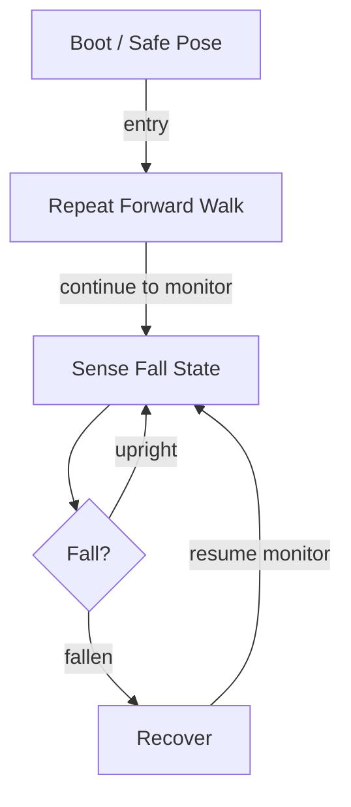

# R-Code Behavior Extract: `MoveAIBO.R`

## Summary

- source: `src/R-CODE/sample/MoveAIBO.R`
- states: `4`
- transitions: `5`
- commands: `PLAY=6, MOVE=6, WAIT=6, SET=2, GO=2, POSE=1, AND=1, IF=1`
- sensed variables: `Gsensor_status`

## State Blocks

- `Boot / Safe Pose`: Boot, Assume Safe Pose
  lines 5: `SET:Power:1`
  lines 6: `POSE:AIBO:slp_slp`
- `Repeat Forward Walk`: Act, Synchronize
  lines 9: `PLAY:SOUND:trk4_xxx:50`
  lines 10: `MOVE:LEGS:WALK:SLOW:FORWARD:10`
  lines 11: `WAIT`
  lines 13: `PLAY:SOUND:trk4_xxx:50`
  lines 14: `MOVE:LEGS:WALK:SLOW:FORWARD:10`
  ... `11` more instructions
- `Sense Fall State`: Initialize State, Sense/Decide, Loop/Transition
  lines 32: `SET:stat:Gsensor_status`
  lines 33: `AND:stat:1`
  lines 34: `IF:=:stat:1:9000`
  lines 35: `GO:200`
- `Recover`: Act, Synchronize, Recover, Loop/Transition
  lines 38: `MOVE:AIBO:ReactiveGU`
  lines 39: `WAIT`
  lines 40: `GO:200`

## Transitions

- `INIT` -> `100`: entry
- `100` -> `200`: continue to monitor
- `200` -> `9000`: fallen
- `200` -> `200`: upright
- `9000` -> `200`: resume monitor

## Mermaid

