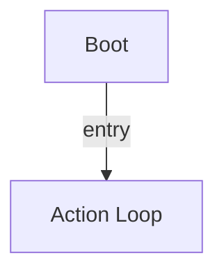

# R-Code Behavior Extract: `MoveTail.R`

## Summary

- category: `Behavior`
- source: `src/R-CODE/sample/MoveTail.R`
- states: `2`
- transitions: `1`
- commands: `MOVE=6, WAIT=6, SET=1`

## State Blocks

- `Boot`: Boot
  lines 5: `SET:Power:1`
- `Action Loop`: Act, Synchronize
  lines 9: `MOVE:TAIL:HOME`
  lines 10: `WAIT`
  lines 12: `MOVE:TAIL:ABS:30:0:1000`
  lines 13: `WAIT`
  lines 15: `MOVE:TAIL:ABS:-30:0:1000`
  ... `7` more instructions

## Transitions

- `INIT` -> `100`: entry

## Mermaid

