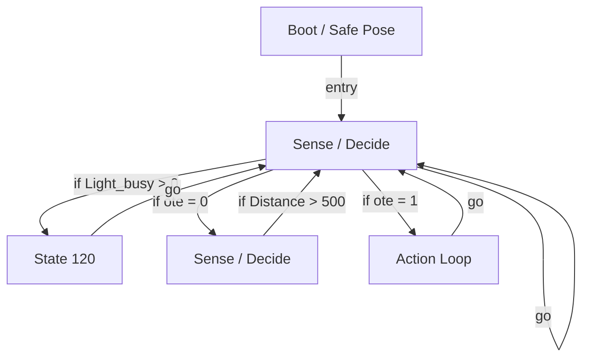

# R-Code Behavior Extract: `OteDog.R`

## Summary

- source: `src/R-CODE/sample/OteDog.R`
- states: `5`
- transitions: `8`
- commands: `CASE=12, SET=6, IF=4, GO=3, WAIT=3, PLAY=3, POSE=1, STOP=1, SWITCH=1, ADD=1`
- sensed variables: `Distance, Light_busy`

## State Blocks

- `Boot / Safe Pose`: Boot, Assume Safe Pose
  lines 6: `SET:Power:1`
  lines 7: `POSE:AIBO:slp_slp`
  lines 8: `SET:head:0`
  lines 9: `SET:ote:0`
- `Sense / Decide`: Sense/Decide, Loop/Transition
  lines 13: `IF:>:Light_busy:0:120`
  lines 14: `IF:=:ote:0:1000`
  lines 15: `IF:=:ote:1:2000`
  lines 16: `GO:100`
- `State 120`: Act, Loop/Transition
  lines 22: `STOP:LIGHT`
  lines 23: `GO:100`
- `Sense / Decide`: Initialize State, Sense/Decide, Synchronize
  lines 27: `SET:ote:0`
  lines 28: `SWITCH:head`
  lines 29: `CASE:0:MOVE:HEAD:ABS:-30:0:0:500`
  lines 30: `CASE:1:MOVE:HEAD:ABS:-30:-30:0:500`
  lines 31: `CASE:2:MOVE:HEAD:ABS:-30:-60:0:500`
  ... `14` more instructions
- `Action Loop`: Initialize State, Act, Synchronize, Loop/Transition
  lines 51: `MOVE:HEAD:ABS:0:0:0:100`
  lines 52: `PLAY:LEGS:LtouchL_sit`
  lines 53: `WAIT`
  lines 54: `PLAY:SOUND:joy7_ttb:30`
  lines 55: `PLAY:LIGHT:joy1_eye:15`
  ... `3` more instructions

## Transitions

- `INIT` -> `100`: entry
- `100` -> `120`: if Light_busy > 0
- `100` -> `1000`: if ote = 0
- `100` -> `2000`: if ote = 1
- `100` -> `100`: go
- `120` -> `100`: go
- `1000` -> `100`: if Distance > 500
- `2000` -> `100`: go

## Mermaid

