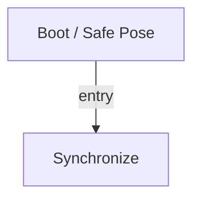

# R-Code Behavior Extract: `PlayLegs.R`

## Summary

- category: `Behavior`
- source: `src/R-CODE/sample/PlayLegs.R`
- states: `2`
- transitions: `1`
- commands: `PLAY=9, WAIT=9, SET=1, POSE=1`

## State Blocks

- `Boot / Safe Pose`: Boot, Assume Safe Pose
  lines 5: `SET:Power:1`
  lines 6: `POSE:AIBO:slp_slp`
- `Synchronize`: Act, Synchronize
  lines 10: `PLAY:LEGS:Brise_slp`
  lines 11: `WAIT`
  lines 13: `PLAY:LEGS:Hand_slpb`
  lines 14: `WAIT`
  lines 16: `PLAY:LEGS:KickL_std`
  ... `13` more instructions

## Transitions

- `INIT` -> `100`: entry

## Mermaid

