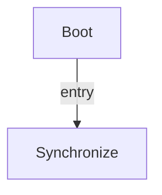

# R-Code Behavior Extract: `PlayLight.R`

## Summary

- category: `Behavior`
- source: `src/R-CODE/sample/PlayLight.R`
- states: `2`
- transitions: `1`
- commands: `PLAY=10, WAIT=5, QUIT=5, SET=1`

## State Blocks

- `Boot`: Boot
  lines 5: `SET:Power:1`
- `Synchronize`: Act, Synchronize, Recover
  lines 9: `PLAY:LIGHT:hppy1eye:0�@`
  lines 10: `PLAY:AIBO:Happy_sit`
  lines 11: `WAIT`
  lines 12: `QUIT:LIGHT`
  lines 14: `PLAY:LIGHT:ang1_eye:0`
  ... `15` more instructions

## Transitions

- `INIT` -> `100`: entry

## Mermaid

