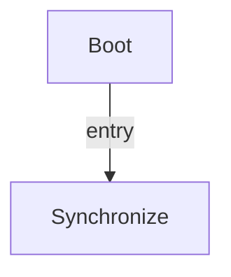

# R-Code Behavior Extract: `PlayTail.R`

## Summary

- category: `Behavior`
- source: `src/R-CODE/sample/PlayTail.R`
- states: `2`
- transitions: `1`
- commands: `PLAY=14, WAIT=14, SET=1`

## State Blocks

- `Boot`: Boot
  lines 5: `SET:Power:1`
- `Synchronize`: Act, Synchronize
  lines 9: `PLAY:TAIL:Akubi_slpb3`
  lines 10: `WAIT`
  lines 12: `PLAY:TAIL:Dere_sitb`
  lines 13: `WAIT`
  lines 15: `PLAY:TAIL:No2_sta`
  ... `23` more instructions

## Transitions

- `INIT` -> `100`: entry

## Mermaid

