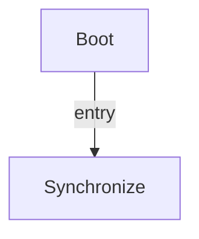

# R-Code Behavior Extract: `PoseHead.R`

## Summary

- category: `Behavior`
- source: `src/R-CODE/sample/PoseHead.R`
- states: `2`
- transitions: `1`
- commands: `PLAY=7, POSE=7, WAIT=7, SET=1`

## State Blocks

- `Boot`: Boot
  lines 5: `SET:Power:1`
- `Synchronize`: Assume Safe Pose, Act, Synchronize
  lines 8: `PLAY:SOUND:trk4_xxx:50`
  lines 9: `POSE:HEAD:oHome`
  lines 10: `WAIT:5000`
  lines 12: `PLAY:SOUND:trk4_xxx:50`
  lines 13: `POSE:HEAD:oLow`
  ... `16` more instructions

## Transitions

- `INIT` -> `100`: entry

## Mermaid

