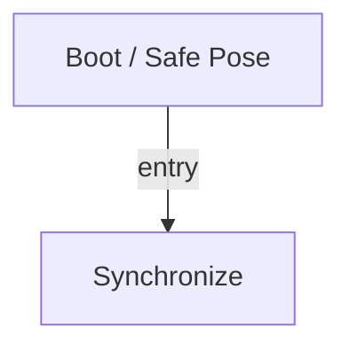

# R-Code Behavior Extract: `PoseLegs.R`

## Summary

- category: `Behavior`
- source: `src/R-CODE/sample/PoseLegs.R`
- states: `2`
- transitions: `1`
- commands: `POSE=7, PLAY=6, WAIT=6, SET=1`

## State Blocks

- `Boot / Safe Pose`: Boot, Assume Safe Pose
  lines 5: `SET:Power:1`
  lines 6: `POSE:AIBO:slp_slp`
- `Synchronize`: Assume Safe Pose, Act, Synchronize
  lines 9: `PLAY:SOUND:trk4_xxx:50`
  lines 10: `POSE:LEGS:oSitting`
  lines 11: `WAIT`
  lines 13: `PLAY:SOUND:trk4_xxx:50`
  lines 14: `POSE:LEGS:oSit_Otel`
  ... `13` more instructions

## Transitions

- `INIT` -> `100`: entry

## Mermaid

