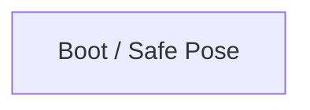

# R-Code Behavior Extract: `Quit2.R`

## Summary

- category: `Behavior`
- family: `Quit`
- variant: `v2`
- source: `src/R-CODE/sample/Quit2.R`
- states: `1`
- transitions: `0`
- commands: `MOVE=10, WAIT=3, SET=1, POSE=1, STOP=1`

## State Blocks

- `Boot / Safe Pose`: Boot, Assume Safe Pose, Act, Synchronize
  lines 5: `SET:Power:1`
  lines 6: `POSE:AIBO:slp_slp`
  lines 7: `WAIT`
  lines 8: `MOVE:HEAD:HOME`
  lines 9: `WAIT`
  ... `11` more instructions

## Transitions

## Mermaid

