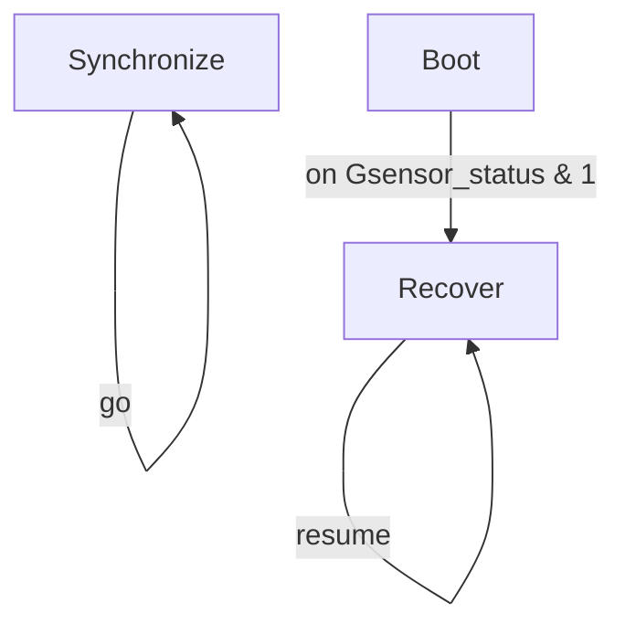

# R-Code Behavior Extract: `Recover.R`

## Summary

- source: `src/R-CODE/sample/Recover.R`
- states: `3`
- transitions: `3`
- commands: `WAIT=2, SET=1, ONCALL=1, GO=1, QUIT=1, MOVE=1, RESUME=1`
- sensed variables: `Gsensor_status`

## State Blocks

- `Boot`: Boot, Sense/Decide, Loop/Transition
  lines 5: `SET:Power:1`
  lines 6: `ONCALL:&:Gsensor_status:1:200:2`
- `Synchronize`: Synchronize, Loop/Transition
  lines 9: `WAIT:1000`
  lines 10: `GO:100`
- `Recover`: Act, Synchronize, Recover, Loop/Transition
  lines 13: `QUIT:AIBO`
  lines 14: `MOVE:AIBO:ReactiveGU`
  lines 15: `WAIT`
  lines 16: `RESUME`

## Transitions

- `INIT` -> `200`: on Gsensor_status & 1
- `100` -> `100`: go
- `200` -> `200`: resume

## Mermaid

