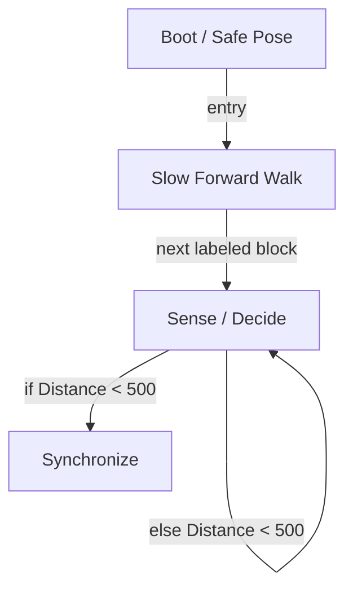

# R-Code Behavior Extract: `SadDog.R`

## Summary

- category: `Behavior`
- source: `src/R-CODE/sample/SadDog.R`
- states: `4`
- transitions: `4`
- commands: `WAIT=3, POSE=2, SET=1, MOVE=1, IF=1, STOP=1, PLAY=1`
- sensed variables: `Distance`

## State Blocks

- `Boot / Safe Pose`: Boot, Assume Safe Pose, Synchronize
  lines 6: `SET:Power:1`
  lines 7: `POSE:AIBO:slp_slp`
  lines 8: `WAIT`
  lines 9: `POSE:AIBO:std_std`
  lines 10: `WAIT`
- `Slow Forward Walk`: Act
  lines 13: `MOVE:LEGS:WALK:SLOW:FORWARD:0`
- `Sense / Decide`: Sense/Decide
  lines 16: `IF:<:Distance:500:300:200`
- `Synchronize`: Act, Synchronize
  lines 19: `STOP:AIBO`
  lines 20: `PLAY:AIBO:Wake_slpb`
  lines 21: `WAIT`

## Transitions

- `INIT` -> `100`: entry
- `100` -> `200`: next labeled block
- `200` -> `300`: if Distance < 500
- `200` -> `200`: else Distance < 500

## Mermaid

