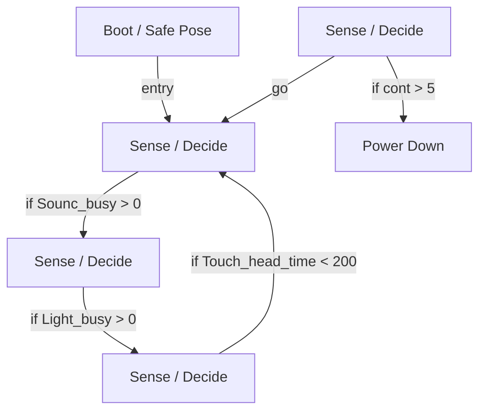

# R-Code Behavior Extract: `SmileDog.R`

## Summary

- source: `src/R-CODE/sample/SmileDog.R`
- states: `6`
- transitions: `6`
- commands: `IF=4, SET=3, PLAY=3, STOP=2, WAIT=2, POSE=1, ADD=1, GO=1, QUIT=1`
- sensed variables: `Light_busy, Touch_head_time`

## State Blocks

- `Boot / Safe Pose`: Boot, Assume Safe Pose
  lines 6: `SET:Power:1`
  lines 7: `POSE:AIBO:slp_slp`
  lines 9: `SET:cont:1`
- `Sense / Decide`: Sense/Decide, Act
  lines 12: `IF:>:Sounc_busy:0:110`
  lines 13: `STOP:SOUND`
- `Sense / Decide`: Sense/Decide, Act, Synchronize
  lines 15: `IF:>:Light_busy:0:120`
  lines 16: `STOP:LIGHT`
  lines 17: `WAIT`
- `Sense / Decide`: Sense/Decide
  lines 20: `IF:<:Touch_head_time:200:100`
- `Sense / Decide`: Sense/Decide, Act, Synchronize, Loop/Transition
  lines 23: `ADD:cont:1`
  lines 24: `IF:>:cont:5:300`
  lines 25: `PLAY:LIGHT:joy3_eye:17`
  lines 26: `PLAY:TAIL:oSittingJoy2`
  lines 27: `PLAY:SOUND:joy1rxxy:30`
  ... `2` more instructions
- `Power Down`: Initialize State, Act, Recover
  lines 32: `QUIT:AIBO`
  lines 33: `SET:Power:0`

## Transitions

- `INIT` -> `100`: entry
- `100` -> `110`: if Sounc_busy > 0
- `110` -> `120`: if Light_busy > 0
- `120` -> `100`: if Touch_head_time < 200
- `200` -> `300`: if cont > 5
- `200` -> `100`: go

## Mermaid

