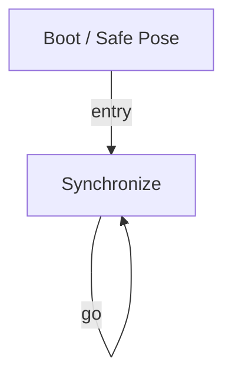

# R-Code Behavior Extract: `SmileAngry.R`

## Summary

- source: `src/R-CODE/sample/SmileAngry.R`
- states: `2`
- transitions: `2`
- commands: `PLAY=6, WAIT=3, SET=1, POSE=1, GO=1`

## State Blocks

- `Boot / Safe Pose`: Boot, Assume Safe Pose
  lines 6: `SET:Power:1`
  lines 7: `POSE:AIBO:slp_slp`
- `Synchronize`: Act, Synchronize, Loop/Transition
  lines 10: `WAIT`
  lines 12: `PLAY:HEAD:Yes_sta`
  lines 13: `PLAY:LIGHT:joy1_eye:17`
  lines 14: `PLAY:SOUND:joy3_xxa:40`
  lines 15: `WAIT`
  ... `5` more instructions

## Transitions

- `INIT` -> `100`: entry
- `100` -> `100`: go

## Mermaid

