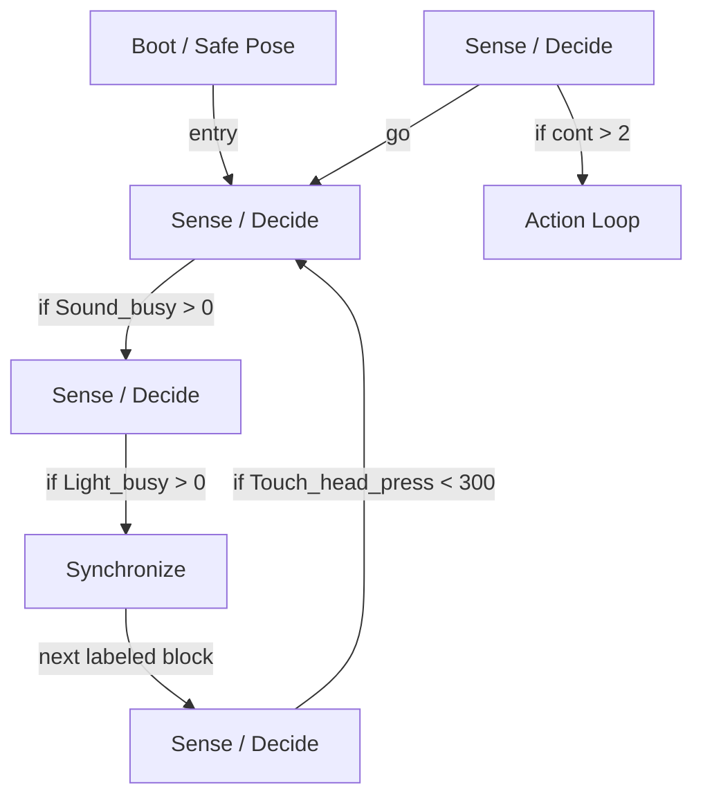

# R-Code Behavior Extract: `SosouDog.R`

## Summary

- category: `Behavior`
- source: `src/R-CODE/sample/SosouDog.R`
- states: `7`
- transitions: `7`
- commands: `PLAY=7, WAIT=7, MOVE=5, SET=4, IF=4, POSE=3, STOP=3, ADD=1, GO=1`
- sensed variables: `Light_busy, Sound_busy, Touch_head_press, Touch_head_time`

## State Blocks

- `Boot / Safe Pose`: Boot, Assume Safe Pose
  lines 9: `SET:Power:1`
  lines 10: `POSE:AIBO:slp_slp`
  lines 11: `SET:bang:0`
  lines 12: `SET:cont:1`
- `Sense / Decide`: Sense/Decide, Act
  lines 15: `IF:>:Sound_busy:0:110`
  lines 16: `STOP:SOUND`
- `Sense / Decide`: Sense/Decide, Act
  lines 18: `IF:>:Light_busy:0:120`
  lines 19: `STOP:LIGHT`
- `Synchronize`: Act, Synchronize
  lines 22: `PLAY:LIGHT:joy4_eye:17`
  lines 23: `PLAY:AIBO:Ran_slpb4`
  lines 24: `WAIT`
- `Sense / Decide`: Initialize State, Sense/Decide
  lines 27: `SET:Touch_head_time:0`
  lines 29: `IF:<:Touch_head_press:300:100`
- `Sense / Decide`: Assume Safe Pose, Sense/Decide, Act, Synchronize, Loop/Transition
  lines 33: `ADD:cont:1`
  lines 34: `IF:>:cont:2:300`
  lines 37: `WAIT`
  lines 38: `PLAY:LIGHT:ang1_eye:17`
  lines 39: `WAIT`
  ... `7` more instructions
- `Action Loop`: Assume Safe Pose, Act, Synchronize
  lines 50: `STOP:LIGHT`
  lines 51: `WAIT`
  lines 52: `MOVE:HEAD:ABS:60:0:0:5000`
  lines 53: `MOVE:HEAD:ABS:-90:0:0:5000`
  lines 54: `WAIT`
  ... `5` more instructions

## Transitions

- `INIT` -> `100`: entry
- `100` -> `110`: if Sound_busy > 0
- `110` -> `120`: if Light_busy > 0
- `120` -> `130`: next labeled block
- `130` -> `100`: if Touch_head_press < 300
- `200` -> `300`: if cont > 2
- `200` -> `100`: go

## Mermaid

