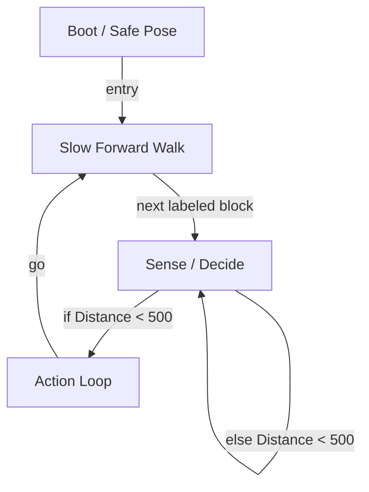

# R-Code Behavior Extract: `Syogai.R`

## Summary

- category: `Behavior`
- source: `src/R-CODE/sample/Syogai.R`
- states: `4`
- transitions: `5`
- commands: `WAIT=2, MOVE=2, PLAY=2, SET=1, POSE=1, IF=1, QUIT=1, GO=1`
- sensed variables: `Distance`

## State Blocks

- `Boot / Safe Pose`: Boot, Assume Safe Pose, Synchronize
  lines 5: `SET:Power:1`
  lines 7: `POSE:AIBO:std_std`
  lines 8: `WAIT`
- `Slow Forward Walk`: Act
  lines 11: `MOVE:LEGS:WALK:SLOW:FORWARD:0`
- `Sense / Decide`: Sense/Decide
  lines 14: `IF:<:Distance:500:300:200`
- `Action Loop`: Act, Synchronize, Recover, Loop/Transition
  lines 17: `PLAY:LIGHT:sup1_eye:0`
  lines 18: `PLAY:AIBO:Biku_sit`
  lines 19: `WAIT`
  lines 20: `QUIT:LIGHT`
  lines 21: `MOVE:LEGS:STEP:SLOW:BACKWARD:10`
  ... `1` more instructions

## Transitions

- `INIT` -> `100`: entry
- `100` -> `200`: next labeled block
- `200` -> `300`: if Distance < 500
- `200` -> `200`: else Distance < 500
- `300` -> `100`: go

## Mermaid

