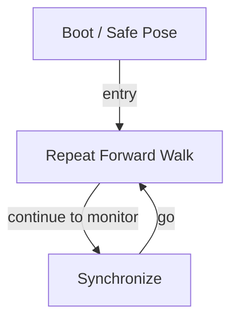

# R-Code Behavior Extract: `TrunAndBow.R`

## Summary

- source: `src/R-CODE/sample/TrunAndBow.R`
- states: `3`
- transitions: `3`
- commands: `WAIT=8, PLAY=5, POSE=2, SET=1, MOVE=1, GO=1`

## State Blocks

- `Boot / Safe Pose`: Boot, Assume Safe Pose
  lines 6: `SET:Power:1`
  lines 7: `POSE:AIBO:slp_slp`
- `Repeat Forward Walk`: Assume Safe Pose, Act, Synchronize
  lines 11: `PLAY:AIBO:std_sit`
  lines 12: `WAIT`
  lines 13: `PLAY:AIBO:StouchL_sit`
  lines 14: `WAIT`
  lines 15: `PLAY:AIBO:StouchR_sit`
  ... `7` more instructions
- `Synchronize`: Act, Synchronize, Loop/Transition
  lines 27: `WAIT`
  lines 28: `PLAY:SOUND:bow1_ddp:30`
  lines 29: `WAIT`
  lines 30: `GO:100`

## Transitions

- `INIT` -> `100`: entry
- `100` -> `200`: continue to monitor
- `200` -> `100`: go

## Mermaid

