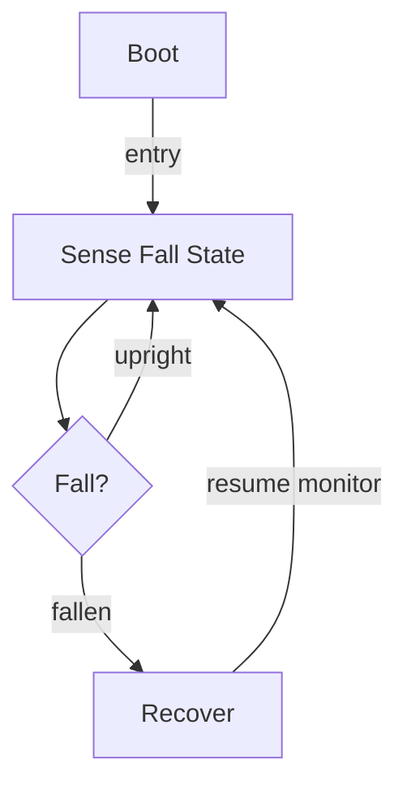

# R-Code Behavior Extract: `WalkDog3.R`

## Summary

- category: `Behavior`
- family: `Walk`
- variant: `v3`
- source: `src/R-CODE/sample/WalkDog3.R`
- states: `3`
- transitions: `4`
- commands: `MOVE=7, SET=2, GO=2, AND=1, IF=1, QUIT=1, WAIT=1`
- sensed variables: `Gsensor_status`

## State Blocks

- `Boot`: Boot
  lines 5: `SET:Power:1`
- `Sense Fall State`: Initialize State, Sense/Decide, Act, Loop/Transition
  lines 8: `SET:stat:Gsensor_status`
  lines 9: `AND:stat:1`
  lines 11: `IF:=:stat:1:200`
  lines 12: `MOVE:LEGS:WALK:ADAPTIVE:FORWARD:10`
  lines 14: `MOVE:LEGS:WALK:CUSTOM:FORWARD:10`
  ... `5` more instructions
- `Recover`: Act, Synchronize, Recover, Loop/Transition
  lines 27: `QUIT:AIBO`
  lines 28: `MOVE:AIBO:ReactiveGU`
  lines 29: `WAIT`
  lines 30: `GO:100`

## Transitions

- `INIT` -> `100`: entry
- `100` -> `200`: fallen
- `100` -> `100`: upright
- `200` -> `100`: resume monitor

## Mermaid

