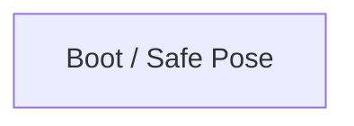

# R-Code Behavior Extract: `WalkDog1.R`

## Summary

- category: `Behavior`
- source: `src/R-CODE/sample/WalkDog1.R`
- states: `1`
- transitions: `0`
- commands: `PLAY=4, MOVE=2, WHILE=2, WEND=2, STOP=2, SET=1, POSE=1, DO=1, LOOP=1`
- sensed variables: `Distance`

## State Blocks

- `Boot / Safe Pose`: Boot, Assume Safe Pose, Act
  lines 7: `SET:Power:1`
  lines 9: `POSE:AIBO:std_std:::1`
  lines 11: `DO`
  lines 14: `MOVE:LEGS:WALK:SLOW:FORWARD:0`
  lines 15: `WHILE:Distance:>:500`
  ... `11` more instructions

## Transitions

## Mermaid

