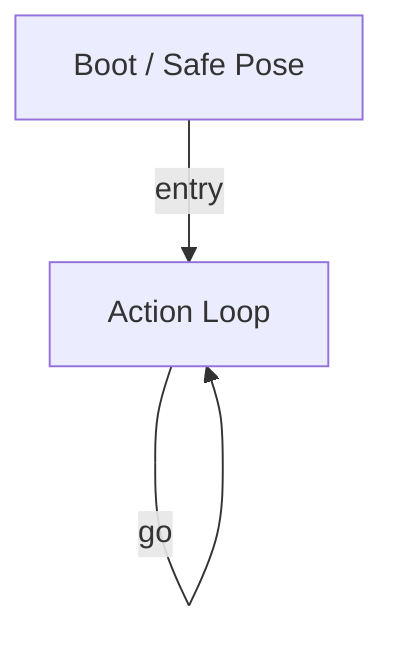

# R-Code Behavior Extract: `WalkAround.R`

## Summary

- category: `Behavior`
- source: `src/R-CODE/sample/WalkAround.R`
- states: `2`
- transitions: `2`
- commands: `MOVE=2, SET=1, POSE=1, WAIT=1, GO=1`

## State Blocks

- `Boot / Safe Pose`: Boot, Assume Safe Pose
  lines 5: `SET:Power:1`
  lines 6: `POSE:AIBO:slp_slp`
- `Action Loop`: Act, Synchronize, Loop/Transition
  lines 11: `MOVE:LEGS:STEP:SLOW:FORWARD:20`
  lines 12: `MOVE:LEGS:STEP:RIGHT_TURN:0:13`
  lines 13: `WAIT`
  lines 14: `GO:100`

## Transitions

- `INIT` -> `100`: entry
- `100` -> `100`: go

## Mermaid

